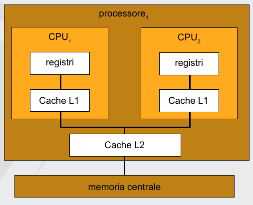

# Evoluzione dei sistemi operativi

Un sistema di elaborazione dati è formato da **hardware** e **software**, noi ci occuperemo del **software di base**, ovvero il minimo necessario per poter usare il calcolatore stesso, al di sopra di cui ci sono i programmi operativi. Il software di base è venduto con l'hardware. Queste definizioni sono cambiate nel tempo, in precedenza il compilatore era considerato software di base, mentre i browser web no, ormai i compilatori non fanno più parte del software di base, mentre il browser sì.

Un sistema di calcolo comprende dal punto di vista hardware una o più CPU, una memoria centrale direttamente accessibile alla CPU, una memoria cache che permette di accelerare le operazioni sulla memoria, un clock, uno o più terminali accessibili anche contemporaneamente, dischi, interfacce di rete, dispositivi per l'I/O ecc.

Il software permette di gestire le parti del sistema e funge da interfaccia tra l'utente e il sistema. Il software di base comprende il sistema operativo, che interfaccia hardware e utente, è avviato al momento del boot e rimane sempre attivo fino allo spegnimento. Ha il compito di rendere la macchina trasparente all'utente. I sistemi operativi possono essere eseguiti su architetture molto differenti, ma hanno sempre le stesse funzioni per l'utente. Un sistema operativo quindi permette di utilizzare architetture diverse attraverso uguali modalità d'uso, ma anche una stessa architettura può essere usata per sistemi operativi differenti.

## Classificazione dei sistemi operativi

In ordine cronologico:

* **dedicati**: prima generazione di macchine per il calcolo numerico e scientifico basate sull'elettronica (anni *'45-55*), basati sulle valvole (funzionalmente corrispondono a transistor, ma più grosse e consumano di più), occupavano un'intera stanza e consumavano una grossa quantità di energia. Vi era un unico gruppo di persone per progetto, costruzione, programmazione, esecuzione e manutenzione. I programmi erano scritti in linguaggio macchina, quindi dipendenti dal calcolatore. Non avevano sistemi operativi, l'utente aveva il pieno controllo della macchina. Negli ultimi anni sono state introdotte le schede perforate.
* a lotti (**batch**): seconda generazione (anni *'55-65*), introduzione dei transistor, più affidabili, piccoli e con consumi inferiori. Diminuzione dei prezzi (milioni di dollari) con conseguente aumento del commercio. Nacquero figure professionali specializzate, differenti da chi aveva costituito la macchina. I **job** erano dei processi, il programmatore scriveva su carta il programma, l'operatore lo introduceva in una coda, il programma produceva dei risultati e l'operatore li consegnava al programmatore. Caricare un programma richiedeva tempi enormi e la CPU era inutilizzata per la maggior parte del tempo. Con il sistema a lotti i programmi venivano accorpati in batch su un solo nastro e passati alla macchina, ciò permise di velocizzare il caricamento, ma rese i sistemi più complessi in quanto servivano altri calcolatori per mettere i programmi su nastro e altri per la stampa dei risultati. La CPU era comunque sottoutilizzata in quanto le periferiche facevano da collo di bottiglia. Nasce il sistema operativo come programma che gestiva il passaggio dall'esecuzione di un job all'altro.
* **multiprogrammazione**: terza generazione (anni *'65-80*), ci sono circuiti integrati. La multiprogrammazione risolve lo spreco di CPU durante l'I/O, permettendo di avere in memoria più programmi contemporaneamente, quando un programma attende l'I/O viene passato al **canale**, liberando la CPU che nel frattempo esegue un altro job. Ciò permetteva il sovrapporsi delle operazioni di I/O all'elaborazione, riducendo i tempi in cui la CPU non era in uso. Nel caso un job non faccia operazioni di I/O questo viene eseguito finché non termina, bloccando l'esecuzione di qualunque altro programma.
* interattivi (**time-sharing**): risolve il problema precedente, il sistema operativo suddivide il tempo della CPU e assegna intervalli ai vari programmi, garantendo la conclusione delle operazioni di ogni programma in un tempo ragionevole. Ogni utente quindi riceveva una percentuale limitata del tempo macchina. L'intervento del sistema operativo permette inoltre di interrompere programmi, evitando quindi di dover spegnere la macchina in caso di un ciclo infinito. La distinzione tra programmi batch e time-sharing differisce per il fatto che il batch massimizza l'uso del processore, il time-sharing minimizza il tempo di risposta.
* **quarta generazione** (personal computer): (anni *'80-oggi*) basati sulla tecnologia **VLSI** (very large scale integration), ovvero si ha una grande quantità di elementi sul singolo chip, aumentando le prestazioni. I sistemi operativi utilizzati sono MS-DOS, e il derivato Windows, oppure UNIX nelle sue varianti, tra cui Linux. MS-DOS era caratterizzato dall'avere un solo utente, non c'era quindi concorrenza, non vi erano meccanismi di protezione.
* **quinta generazione** (mobile): (anni *'90-oggi*) si parla di sistemi mobili, partendo dai PDA ormai scomparsi, soppiantati dai telefoni cellulare, ai sistemi per la gestione dei sensori. Problemi con questi sistemi sono memoria limitata, processori lenti per limitare il consumo, schermo piccolo e i nuovi modelli di interazione, tra cui touchscreen, comandi vocali, gestuali, eye-tracking.

L'utilizzo di personal computer ha permesso lo sviluppo di reti:

* **Network operating systems**: in cui l'utente "vede" più calcolatori, può accedere a macchine remote, copiare file e ogni macchina ha il suo sistema operativo locale.
* **Distributed operating system**: il sistema è visto come una macchina unica, l'esecuzione di programmi può essere in parallelo su diverse macchine. Gli *n* processori possono o meno condividere clock e memoria (in tal caso sono detti **tight coupled**).

### Sistemi Real Time

Il sistema è dedicato a una particolare funzione e ha dei vincoli nel tempo di risposta, si parla di sistemi per la gestione di strumentazione, controllo di processi, gestione di allarme, transazionali. Le operazioni mandate in esecuzione vengono eseguite entro un tempo massimo, non è importante la velocità di risposta, quanto il fatto di garantire la risposta in un tempo prefissato.

## Componenti di un sistema di elaborazione

* **CPU**: componente hardware che esegue le istruzioni, ha dei registri e una cache.
* **Processore**: contiene una o più CPU.
* Unità di calcolo (**core**): unità di elaborazione di base di una singola CPU.

I sistemi multiprocessore e multicore sono nati dall'idea che sia meglio duplicare le unità di elaborazione al posto di renderle estremamente complesse al fine di aumentare le prestazioni.

Multiprocessore significa che il sistema include più processori.


Multicore significa che in una CPU ci sono più core.



Nei sistemi multicore ogni core ha una sua cache di primo livello ed una di secondo, condivisa, che si interfaccia con la memoria centrale. Aumentare il numero di CPU introduce problemi con la gestione della memoria, peggiorando le prestazioni nel suo accesso.

### Sistemi NUMA

La soluzione è avere per ogni CPU una memoria locale accessibile attraverso un bus locale che permette un accesso non uniforme alla memoria. I sistemi NUMA scalano in maniera più efficacie nelle architetture con più processori. Nei sistemi di questo tipo possono essere presenti rallentamenti se un processore deve accedere alla memoria di un processore diverso.

Si parla di **accesso non uniforme** alla memoria perché l'accesso a parti diverse della memoria può avvenire in tempi diversi a seconda del fatto che la memoria sia collegata alla CPU o sia legata a una CPU diversa.

# Struttura dei sistemi operativi

## Gestione dei processi

Un **processo** è un programma in esecuzione che ha bisogno di determinate risorse per poter funzionare (dispositivi I/O, memoria, file, ecc..). Un **programma** è un'entità passiva, al pari del contenuto di un file, mentre un processo è un'entità attiva. Il sistema operativo ha la responsabilità di creare e terminare processi, inoltre può sospenderli, riprenderli, sincronizzarli e permetterne la comunicazione.

## Gestione della memoria

Il sistema operativo deve anche gestire la memoria centrale, utilizzata contemporaneamente da CPU e dispositivi di I/O, ciò crea problemi di condivisione dei dati e sincronizzazione fra gli elementi del sistema. La memoria centrale è l'unico dispositivo di memorizzazione effettivamente usato dalla CPU, che non ha la possibilità di accedere direttamente ad altri dispositivi di memorizzazione (come il disco), le istruzioni possono essere eseguite solo se sono in memoria. Per gestire più programmi in memoria esistono schemi che dipendono dall'hardware.

La memoria secondaria non è normalmente accessibile agli utenti, il sistema operativo interfaccia l'utente e i dispositivi di memorizzazione di massa e deve quindi gestire lo spazio libero, allocare lo spazio ai file, fare lo scheduling del disco (ovvero decidere le strategie migliori per accedere in maniera più efficacie alle informazioni sui dispositivi di memorizzazione di massa). Il sistema operativo nasconde l'hardware all'utente tramite un sistema di buffer-caching. Mediante i driver è possibile accedere ai vari dispositivi, solo il driver conosce le caratteristiche specifiche del dispositivo controllato.

## Gestione dei file

La gestione dei file implica la gestione dell'hardware (velocità, capacità, metodi di accesso casuali o sequenziali). Dal punto di vista del sistema operativo esiste un solo tipo di oggetto, il file. Il **file** è l'unica unità logica di gestione della memoria di massa, il sistema operativo avrà bisogno di metodi per la creazione e cancellazione di file e di directory, meccanismi di mapping e backup dei file. Un file è costituito da una raccolta di informazioni correlate definita dal suo creatore.

## Gestione delle reti

Il sistema operativo gestisce lo stack di rete e permette la visione di più macchine come se fossero un'unica macchina. Un sistema distribuito è un insieme di unità che non condividono la memoria, i dispositivi periferici o il clock. Queste unità comunicano tramite le reti, attraverso opportuni **protocolli**. Il sistema appare come se avesse una singola memoria principale e di massa, un approccio di questo tipo è utile per filesystem distribuiti. L'accesso a risorse condivise permette di accelerare il calcolo, aumentare la disponibilità di dati e incrementare l'affidabilità.

## Gestione delle protezioni

Un sistema operativo ha più processi eseguiti contemporaneamente (in concorrenza), le informazioni di ogni processo devono essere protette dagli altri processi. Occorrono quindi meccanismi di autorizzazione. Con protezione si intende il meccanismo che controlla l'accesso da parte di programmi, processi o utenti alle risorse di un sistema di calcolo.

## Interprete dei comandi

Non fa parte del sistema operativo, ma del software di base. Rappresenta l'interfaccia tra utente e sistema, permette all'utente di lanciare i programmi di cui ha bisogno per completare determinati compiti. Può avere aspetti diversi come: istruzioni di controllo, shell e interfaccia grafica. Ha il compito di accettare comandi e tradurli in operazioni.

## System call

Un sistema operativo è costituito da kernel e interfaccia verso l'utente (o meglio verso i programmi in esecuzione dall'utente), quest'utlima è quella che effettivamente accetta i comandi e li traduce in operazioni. All'interno del sistema operativo esistono vari moduli per la gestione di queste operazioni. Esiste un'interfaccia verso l'hardware che serve a tradurre le richieste in operazioni più complesse (ad esempio segnali elettrici che controllano l'hardware). Il kernel ha quindi due interfacce, una verso l'hardware e una verso gli utenti, che servono per standardizzare il modo di scambiare le informazioni. Ciò semplifica la scrittura del sistema operativo trattando con astrazione le componenti hardware. L'interfaccia tra programmi e sistema operativo costituita dalle system call, queste creano, cancellano e usano gli oggetti software gestiti direttamente solo dal sistema operativo. Le system call cambiano da sistema a sistema, a seconda di architettura e sistema operativo. Esistono chiamate per controllo dei processi, gestione dei file, dei dispositivi, delle informazioni e della comunicazione. Alla system call corrisponde una procedura di libreria che mette i parametri della chiamata in una posizione predefinita, inizializza un'istruzione **TRAP** (un interrupt software) che attiva il sistema operativo e risponde in maniera opportuna alla richiesta. Ciò rende le system call come chiamate di procedure normali.

I programmi di sistema permettono di utilizzare le chiamate di sistema in maniera più gestibile.

## Tipi di struttura

Premessa: per garantire che i programmi non corretti non interferiscano con gli altri processi, l'hardware permette al sistema operativo di operare in due modalità differenti tramite il **mode bit**:

* **user mode**: normale funzionamento dei programmi utente.
* **kernel mode** (detta anche monitor mode o system mode): utilizzata per operazioni effettuate dal sistema operativo.

Dopo un interrupt si passa alla kernel mode e, dopo le operazioni effettuate, prima di tornare al programma dell'utente, si torna alla user mode. Alcune istruzioni, come le istruzioni di I/O, possono essere eseguite solo in kernel mode e sono dette **privileged instructions**.

Il **kernel** è un programma come qualunque altro eseguibile, scritto in un linguaggio di alto livello e compilato. Alcune parti possono essere scritte in assembly, ma solo le componenti più critiche.

Alcuni tipi di strutture per un sistema operativo sono:

* **Struttura monolitica**: tutte le funzionalità del kernel vengono inserite in un singolo binario statico, che viene eseguito in un singolo spazio di indirizzamento. Le funzionalità sono utilizzate mediante le system call, esse comportano il salvataggio dei parametri e l'esecuzione di un interrupt software detto kernel call o supervisor call. Il programma utente esegue una TRAP verso il kernel, l'OS determina il numero del servizio richiesto, individua e chiama la procedura di servizio, infine viene restituito il controllo al programma utente. 
  Vantaggi: ha un netto vantaggio prestazionale dovuto al ridotto **overhead** e alla velocità di comunicazione all'interno del kernel. 
  Svantaggi: questo tipo di struttura è difficile da implementare ed estendere.
* **Approccio stratificato**: inizio di strutturazione, esistono vari strati, il più esterno corrisponde all'interfaccia utente e il più interno all'hardware. Esiste una procedura principale in relazione con il livello utente, la quale, tutte le volte che è richiesto un servizio al sistema operativo (e a seconda del servizio richiesto), richiede l'intervento di procedure di servizio dallo strato inferiore. Ogni strato può comunicare solo con quelli adiacenti. 
  Vantaggi: il vantaggio di una struttura **debolmente accoppiata** (come questa) è che la modifica di uno strato non comporta cambiamenti negli altri componenti, come succede invece nelle strutture strettamente accoppiate. Inoltre è più semplice da progettare. 
  Svantaggi: ha prestazioni più scarse a causa dell'overhead dovuto al passaggio tra più strati delle richieste.
* **Struttura a microkernel**: il kernel viene reso minimo, spostando quante più funzioni possibile nello spazio utente. Lo scopo principale di questa struttura è di fornire funzioni di comunicazione tra i processi e i vari servizi, anch'essi eseguiti nello spazio utente. La comunicazione viene effettuata mediante messaggi. 
  Vantaggi: modificare ed estendere il kernel diventa più semplice, con maggiore portabilità e affidabilità, poiché il codice critico è minore. 
  Svantaggi: è presente un overhead dovuto alle comunicazioni.
* **Modello client-server**: si cerca di limitare la dimensione del kernel, implementando le funzioni nei processi utente come per il microkernel. La richiesta di un servizio da parte del processo client viene gestita dal processo server, ed il kernel si occupa della gestione della comunicazione. Il kernel è diviso in parti piccole e maneggevoli che si riferiscono ad un solo aspetto del sistema (memoria, file ecc..). Alcune funzioni di sistema non sono eseguibili nello spazio utente, si hanno due possibili soluzioni: i processi critici vengono eseguiti in modalità kernel oppure si effettua una divisione tra meccanismo, minimo e implementato nel kernel, e decisioni di strategia, lasciate ai processi nello spazio utente. 
  Vantaggi: adattabilità all'utilizzo in sistemi distribuiti.
* **Struttura a moduli**: si basa sull'idea che il kernel debba fornire direttamente solo i servizi principali, mentre i restanti possono essere implementati in modo dinamico tramite moduli. Un **modulo** è una porzione di codice del sistema operativo che può essere caricata mentre il sistema è funzionante, il kernel può essere esteso o modificato senza necessità di ricompilazione e riavvio. Simile ai sistemi multilivello, in quanto ogni sezione del kernel ha interfacce protette e ben definite, ma è più flessibile in quanto ogni modulo può chiamare qualsiasi altro modulo. Assomiglia anche all'approccio a microkernel, per il fatto che il modulo principale ha solo le funzioni di base, ma è più efficiente perché i moduli non devono invocare le funzionalità di trasmissione di messaggi per comunicare. Ogni modulo ha un'interfaccia verso il kernel tramite cui interagisce.

## Virtualizzazione

La virtualizzazione è una tecnica che permette di astrarre l'hardware di un singolo computer in diversi ambienti di esecuzione. 
Vantaggi: ogni parte è più semplice, flessibile e facile da manutenere. Permette una completa protezione delle risorse del sistema e rende facile lo sviluppo di un sistema operativo. 
Svantaggi: l'isolamento della macchina virtuale rende complessa la condivisione di risorse.

**Modalità 8086**: i primi processori Intel con MS-DOS permettevano di avere la macchina a completa disposizione, permettendo efficienza, ma rendendo rischioso l'uso delle macchine. Le versioni successive di Windows hanno introdotto la doppia modalità di funzionamento (kernel e user mode), perciò gran parte del software scritto fino a quel momento diventò inutilizzabile, fu quindi necessaria una modalità che permetteva di eseguire i vecchi programmi fino a che non facessero uso di istruzioni privilegiate, che venivano intercettate ed eseguite dal kernel.

Le macchine virtuali sono caratterizzate dall'utilizzo di un **hypervisor**, ovvero un manager per la macchina virtuale. Ci sono due tipi:

* **tipo 1**: una sorta di sistema operativo lanciato al momento del boot, ha il controllo completo del sistema, crea un hardware virtuale e vi esegue i sistemi operativi **guest**.
* **tipo 2**: applicazione installata sul sistema un sistema operativo residente sulla macchina. Gli OS guest lavorano sempre nella modalità utente, ma nel momento in cui una macchina virtuale richiede un'operazione privilegiata, l'hypervisor la intercetta e la passa al sistema operativo. Per lo scambio di informazioni tra le macchine si possono usare reti virtuali con NAT, DHCP e accesso alla rete, rendendole dall'esterno indistinguibili da macchine reali.

Le macchine virtuali inoltre rendono più facile la distribuzione del software tramite VM già configurate e pronte all'uso ed è possibile eseguire backup salvando lo stato della macchina virtuale ed effettuandone una copia. I requisiti per una virtualizzazione efficacie si basano sul fatto che le istruzioni vengono divise in tre gruppi: **privilegiate**, **di controllo** (che modificano le risorse del sistema) e istruzioni il cui risultato dipende dalla configurazione del sistema. Le istruzioni di controllo devono essere un sottoinsieme delle istruzioni privilegiate.

### Emulazione

L'emulazione è una tecnica utilizzata quando il tipo di CPU di origine è diverso da quello di destinazione. Permette l'esecuzione di un OS su una CPU completamente differente, è poco efficiente dovendo emulare ogni singola istruzione mediante, ad esempio, una decina di istruzioni native.

### Paravirtualizzazione

Nella paravirtualizzazione l'OS guest deve essere modificato in modo da sostituire le istruzioni privilegiate con chiamate a codice che emulano l'istruzione, ciò può essere fatto riscrivendole, processo lento, ma con prestazioni finali superiori, quasi pari a un sistema non virtualizzato, o intercettandole tramite l'hypervisor e riscrivendole in tempo reale.

# Processi

Dal punto di vista dei processi l'OS è l'interfaccia verso l'hardware, esso inoltre deve mettere a disposizione all'utente una serie di servizi che permettano la creazione di nuovi processi, allocare loro delle risorse, permettere la comunicazione tra loro e interallacciarne l'esecuzione per massimizzare l'uso del processore, fornendo però un tempo di risposta ragionevole.

Il processo è l'astrazione di un programma in esecuzione. Sebbene due processi siano associabili allo stesso programma, sono da considerare due entità distinte. La struttura di un processo in memoria è generalmente divisa in più sezioni:

* **Sezione di testo**: contenente il codice eseguibile.
* **Sezione dati**: contenente le variabili globali.
* **Heap**: memoria allocata dinamicamente durante l'esecuzione del programma.
* **Stack**: memoria temporaneamente utilizzata durante le chiamate di funzioni.

## Stati di un processo

Durante l'esecuzione i processi passano per un certo numero di stati predefiniti:

* **Nuovo**: il processo viene creato.
* **Pronto**: il processo attende di essere assegnato ad un'unità di elaborazione.
* **Esecuzione**: le istruzioni del processo vengono eseguite. In ciascuna unità di elaborazione può essere in esecuzione un solo processo per volta.
* **Attesa**: il processo ha lasciato la CPU, dove un altro ha preso il suo posto. È in attesa che si verifichi un evento, come la terminazione di un'operazione I/O. Terminata l'attesa torna ad essere pronto per l'esecuzione.
* **Terminato**: il processo ha terminato l'esecuzione.


Nei sistemi time sharing esiste anche la possibilità che il processo passi dallo stato di esecuzione allo stato pronto, in questo caso si parla di OS con **diritto di prelazione**.

I processi si dividono in due tipologie a seconda che impieghino la maggior parte del tempo per l'elaborazione o per le operazioni di I/O. Sono detti **CPU bound** nel primo caso e **I/O bound** nel secondo.

## Scheduler

Modulo che prende la decisione su quali processi devono andare in esecuzione quando la CPU è libera, a lui è lasciata la gestione delle interruzioni e i dettagli sulla gestione dei processi. Statisticamente è visibile che generalmente per la maggior parte del tempo i processi attendano operazioni I/O e solo una piccola parte è impiegata per l'elaborazione.

Dato il gran numero numero di processi costantemente eseguiti contemporaneamente si vuole ottenere la **multiprogrammazione**, ovvero la situazione in cui diversi processi possano essere attivi nello stesso istante. Con un modello a multiprogrammazione il program counter salta da un processo all'altro dando l'impressione di avere processi che lavorino contemporaneamente. 
**Pseudoparallelismo**: il sistema da all'utente l'impressione che tutti i processi lavorino contemporaneamente, cambiando rapidamente il processo in esecuzione, preso tra quelli disponibili.

### Context switch

Consiste nella sostituzione del processo in esecuzione, durante la quale lo stato del processo sostituito viene salvato (nel **Process Control Block**) per essere riavviato successivamente, in seguito a cui vengono caricate le informazioni del processo successivo. Un processo non ha percezione di essere stato bloccato e riavviato. Il tempo impiegato per il context switch è tempo sprecato. Nei sistemi con diritto di prelazione, dopo una certa quantità di tempo, se il processo in esecuzione non richiede operazioni di I/O, l'OS cambia il processo in elaborazione. La durata del quanto di tempo per ogni processo non deve essere troppo breve per evitare eccessivi context switch, riducendo l'efficienza della CPU, ma non deve nemmeno essere troppo lunga, per evitare tempi di risposta maggiori a processi interattivi con tempo di esecuzione breve. Un'altra causa di cambio di processo è la creazione di un processo figlio, in tal caso sia padre che figlio vanno nella coda.

## Implementazione di un processo

È necessaria una **tabella dei processi** in cui vengono memorizzate le informazioni relative ai processi (utili al loro ripristino dopo che sono stati bloccati) sotto forma di vettore di strutture dati. Per ogni processo ci sarà un PCB (Process Control Block) contenente lo stato del processo, il valore del program counter, stack pointer, allocazione di memoria, stato dei file aperti, informazioni sullo scheduling ecc.. La dimensione della tabella è limitata e ciò vincola il numero di processi eseguibili.

## Creazione dei processi

I processi vengono principalmente creati da servizi o da altri processi. La **shell** non fa parte del sistema operativo, è un interprete dei comandi, e viene avviata al login dell'utente. A ogni comando sulla shell, il suo processo genera un processo figlio. Esistono varie possibilità per la **condivisione di risorse**:

* padre e figli condividono tutte le risorse.
* i figli condividono un sottoinsieme delle risorse del padre.
* padre e figli non condividono alcuna risorsa.

Per **l'esecuzione**:

* processo padre e processi figli possono essere eseguiti in maniera concorrente.
* il padre attende che i figli terminino.

Per lo **spazio degli indirizzi**:

* il figlio può essere un duplicato del padre, avendo così due processi identici in esecuzione.
* il processo figlio è un nuovo programma.

In UNIX un processo è creato tramite la chiamata di sistema **fork**, mediante cui viene creato un secondo processo identico al padre.

### Memoria e processi in UNIX

Un processo è identificato da un **pid** e costituito da 4 parti principali che costituiscono la sua immagine:

* **u-area**: dati relativi al processo di pertinenza del sistema operativo (tabella dei file, working directory ecc.).
* **dati**: i dati globali del processo.
* **stack**.
* **codice**: il codice eseguibile del processo.

Nella parte bassa della memoria vengono salvati codice e dati, mentre lo stack parte dagli ultimi indirizzi a scendere.

Esiste una piccola differenza tra il processo padre e il processo figlio, la chiamata fork restituisce al processo padre il PID del figlio, al figlio il valore 0. Di conseguenza i due processi sanno se sono padre o figlio. Il processo figlio esegue una chiamata di sistema **exec**, questa chiamata ha due parametri: un **pathname**, ovvero dove è memorizzato il file con il codice del programma da eseguire e una serie di **argomenti** da passare al programma. Il codice del chiamante viene quindi sostituito con il codice del programma che si vuole eseguire, non viene generato un altro processo figlio.

In ambiente Windows non esistono un processo padre e un processo figlio, in quanto i due processi non sono legati in alcun modo.

### Albero dei processi UNIX

Durante il boot viene avviato uno speciale processo, detto **init**, che rimane sempre attivo fino allo spegnimento, un suo malfunzionamento porterebbe al crash del sistema. A partire da init vengono generati tutti i processi attivi sul sistema, di conseguenza si ottiene una struttura ad albero con init come radice. init ha il pid 1. Per conoscere i processi attivi si usa il *Task Manager* su Windows, *top* (oppure *ps*) su Linux.

### Commento esempio creazione processo


Alla seconda riga si include la libreria *unistd.h*, che contiene funzioni per interagire col sistema UNIX. La funzione fork genera un processo figlio e restituisce un intero detto PID. Il codice verrà eseguito sia dal processo padre che dal processo figlio, la fork restituisce l'identificatore del figlio al padre e il valore 0 al figlio, in tal modo mediante un *if* è possibile indirizzare l'esecuzione, diversificando l'esecuzione di padre e figlio. Può essere restituito un valore negativo se la creazione del processo fallisce. *exit()* è una chiamata a sistema che richiede la terminazione del processo corrente, ha un parametro che indica se il parametro è terminato in maniera corretta o con problemi. Per uscire dalla funzione *main,* exit può essere sostituito da *return*. *wait()* è una chiamata di sistema che blocca un processo in attesa di qualcosa. Il processo padre può interrompere i processi figli, se ad esempio il processi padre ha richiesto troppe risorse, se il compito dei figli non è più necessario o (in alcuni casi) se il processo padre termina, in tal caso si parla di *abort*.

### Famiglia exec

Esistono diverse varianti del comando exec, ad esempio:

* **execve** è la funzione base su cui sono costruite le altre, ha tre parametri: il primo è una stringa di caratteri che indica il pathname del programma, il secondo è un vettore di stringhe per passare gli argomenti ed il terzo è un vettore di stringhe in cui sono presenti le variabili d'ambiente (una serie di stringhe e caratteri che associano a una determinata chiave un valore, ad esempio *PATH* indica dove andare a cercare gli eseguibili) che verranno utilizzate.
* **execl** è una funzione che ha un numero arbitrario di parametri, il path e gli argomenti passati, il cui ultimo deve necessariamente essere un puntatore nullo.
* **execlp** usa una stringa per identificare il programma che va trovato mediante il PATH di ambiente.

Ci sono molte varianti, in breve:

* ...**l** (list): i parametri sono una lista di argomenti della funzione, si aggiunge sempre *NULL* in coda.
* ...**e** (environment): utilizza le variabili d'ambiente.
* ...**p** (path): fa riferimento alla variabile di shell $PATH.
* ...**v** (vector): i parametri sono memorizzati in un vettore, con un elemento terminale *NULL*.

Informazioni più dettagliate si possono trovare tramite il *man* di Linux. Esiste un altro modo più semplice per mandare in esecuzione un programma, la funzione **system**, ha un unico parametro, una stringa di caratteri che rappresenta il programma da eseguire, e restituisce il valore di controllo.

# Scheduling

Lo scheduler è la parte del sistema operativo che decide quale processo deve essere eseguito, è governato da un **algoritmo di scheduling**. Ogni processo è unico ed imprevedibile quindi per evitare tempi troppo lunghi di esecuzione molti sistemi operativi prevedono un timer o clock. Ad ogni interrupt del clock il sistema operativo decide se il processo può continuare oppure se deve essere sospeso per permettere l'esecuzione di un diverso processo presente in memoria. La strategia che consente di sospendere temporaneamente processi che sono logicamente eseguibili viene detta **preemptive scheduling** (scheduling con diritto di prelazione), in contrapposizione al metodo di esecuzione a completamento (tipico dei sistemi batch) o non-preemptive scheduling (senza diritto di prelazione). Quest'ultimo è stato il primo approccio utilizzato, in quanto i programmi non erano interattivi e di conseguenza non c'era bisogno di interrompere un programma per lasciare l'esecuzione agli altri. Come agisce lo scheduler: seleziona fra i processi in memoria quelli pronti per l’esecuzione e assegna la CPU a uno di essi, la decisione di scheduling della CPU può avvenire quando un processo:

* passa dallo stato di *esecuzione* allo stato di *attesa*.
* passa dallo stato di *esecuzione* allo stato *pronto*.
* passa dallo stato di *attesa* allo stato *pronto*.
* termina.

L'intervento dello scheduling del primo e dell'ultimo caso è non-preemptive, quello degli altri è preemptive.

## Dispatcher

Il dispatcher è il modulo che dà il controllo della CPU al processo selezionato dallo scheduler; l’operazione comprende: il cambio di contesto, il passaggio alla modalità utente e il salto alla giusta posizione del programma utente. Il tempo necessario è chiamato latenza di dispatch.

## Criteri di valutazione

Un buon algoritmo di scheduling dovrebbe soddisfare i seguenti criteri:

* **Equità**: ogni processo deve avere a disposizione una corretta quantità di tempo di CPU per portare a termine il proprio compito.
* **Efficienza**: la CPU dovrebbe essere utilizzata il 100% del tempo, dal punto di vista di un personal computer questo criterio non è spesso preso in considerazione, è invece importante in grossi sistemi di calcolo.
* **Tempo di completamento**: deve essere il più piccolo possibile, è la somma dei tempi passati nell'attesa dell'ingresso in memoria, nella ready queue, durante l'esecuzione nella CPU nelle operazioni di I/O.
* **Tempo di risposta**: tempo che intercorre fra l'effettuazione di una richiesta e la risposta prodotta, deve essere minimizzato per i processi interattivi.
* **Tempo di attesa**: l'algortimo di scheduling non influisce sul tempo di esecuzione del processo, ma influisce sul tempo di attesa nella ready queue. Il tempo di attesa è la somma degli intervalli nella coda di attesa e deve essere minimizzato.
* **Throughput**: occorre massimizzare il numero di job processati per unità di tempo.

Essendo il tempo di CPU finito alcuni di questi obiettivi non sono compatibili fra di loro.

## Algoritmi

### FCFS (first come first served)

È la banale implementazione di coda FIFO, i processi sono eseguiti nell'ordine in cui arrivano in stato *pronto*. Essendo molto semplice è molto efficiente in termini di context switch. Però in caso un processo lungo abbia in coda dei processi più corti, questi aspetteranno molto prima di essere eseguiti, sarebbe meglio eseguire i processi più corti per primi.

### SJF (shortest job first)

Algoritmo particolarmente indicato per l'esecuzione batch di job per i quali i tempi di esecuzione sono noti a priori. Viene scelto il primo processo come quello che ha la durata minore, e, a parità di durata, il primo arrivato. Garantisce sempre il minimo tempo medio d'attesa, è quindi detto **ottimale**. Si pone il problema di determinare quale dei processi è il più breve, problema risolvibile mediante stime sul comportamento passato dei processi in esecuzione. Un altro metodo è utilizzare un tempo di esecuzione previsto, fornito dal processo stesso. Ci sono due possibili implementazioni a seconda della presenza del diritto di prelazione:

* non-preemptive: il processo in esecuzione non può essere interrotto.
* preemptive: se arriva un nuovo processo con un CPU burst atteso più breve del tempo rimanente per il processo corrente, il nuovo processo ottiene la CPU. Il criterio è noto anche come Shortest-Remaining-Time-First (**SRTF**).

### RR (round robin)

Scheduler normalmente utilizzato nei sistemi operativi, si presuppone che ogni processo abbia un quanto di tempo a sua disposizione, se il processo supera questo tempo, l'OS interviene e mette in esecuzione un altro processo. Ogni processo ha pari priorità di esecuzione e la coda è gestita con il metodo FIFO. Questo approccio garantisce che tutti gli utenti ottengano il servizio in un tempo ragionevole. Le prestazioni di questo algoritmo dipendono molto dalla dimensione del quanto di tempo scelto, un tempo eccessivo riduce l'algoritmo ad un FCFS, uno troppo corto porta a un numero elevato di context switch. Generalmente ha un tempo di completamento medio più alto rispetto al SJF, ma ha una risposta migliore.

## Scheduling a priorità

Ad ogni processo viene assegnata una priorità, l'algoritmo di schedulazione diventa molto semplice in quanto viene eseguito il processo con priorità maggiore. Altri algoritmi di scheduling possono essere riportati ad uno a priorità stabilendo, ad esempio, la priorità come inversa della durata del processo, come per il FJS. È possibile che processi con una priorità alta vengano eseguiti indefinitamente, per evitarlo lo scheduler decrementa la priorità del processo in esecuzione dopo un certo periodo (ad esempio ad ogni interrupt del clock), ciò permette ai processi in coda di superare la priorità del processo in esecuzione. Le priorità possono essere assegnate **staticamente** o **dinamicamente**, nel primo caso non cambiano nel tempo o al mutare delle condizioni all'interno del sistema. I processi vengono rappresentati in **classi di priorità** e usare un sistema di scheduling basato sulle classi, a questo punto all'interno della singola classe è sufficiente un criterio di tipo RR per gestire il succedersi dei processi.

### Aging

Un problema relativo agli algoritmi con priorità è la **starvation**, ovvero l'attesa indefinita. Per valutare il tempo medio aspettato da un processo, la media delle esecuzioni precedenti non è un approccio utilizzato perché, se un processo cambia comportamento durante l'esecuzione, questo cambiamento non è valutato in maniera significativa, inoltre bisognerebbe mantenere tutti i tempi precedenti. Un approccio migliore consiste nell'aging, tecnica per la stima del valore successivo in una serie basata sul calcolo della media pesata del valore correntemente misurato e la stima precedente. Questa tecnica da un peso maggiore ad un comportamento recente rispetto ad uno passato.

### Code multilivello

Invece di avere una singola coda di processi pronti si possono avere più code separate, i criteri per separare le code possono essere, ad esempio tra processi in background e foreground. Inoltre, ogni coda può usare algoritmi di scheduling differenti. È necessario decidere uno scheduling tra le code, ad esempio mediante priorità fissa o un meccanismo di tipo time slice.

#### Code multiple statiche

Sono, ad esempio, basate su criteri politici, selezionando la priorità in base al tipo di utente.

#### Code multiple dinamiche

Un processo può passare da una coda all'altra. Una possibilità è dare quanti di tempo e priorità differenti alle varie classi in ordine crescente, quando un processo ha utilizzato i quanti ad esso assegnati, passa alla classe sottostante. In questo modo i processi lunghi scendono nelle code con quanti più lunghi e priorità inferiore, dando così la precedenza a processi interattivi brevi.

## Scheduling garantito

Approccio di scheduling in cui l'OS fa promesse all'utente e poi e poi cerca di mantenerle. Un esempio: se ci sono *n* utenti connessi, ogni utente si aspetta di ricevere *1/n* della potenza della CPU, per fare ciò il sistema deve tenere traccia di quanto tempo della CPU un utente ha utilizzato e di quanto tempo di CPU spetta ad ogni utente. La priorità sarà quindi calcolata come rapporto tra il tempo di CPU effettivamente utilizzato da un utente e il tempo che gli sarebbe spettato. Un approccio di questo tipo è utilizzato nei sistemi RT, la priorità è data a un processo che rischia di non rispettare la scadenza.

## Scheduling a estrazione

Ad ogni processo si assegna un certo numero di *biglietti della lotteria*, che rappresentano il tempo di CPU, lo scheduler pesca a caso un biglietto tra i disponibili, quindi più biglietti significano più possibilità di ottenere la CPU. Reagisce velocemente ai cambiamenti e non è soggetto a starvation. I processi possono scambiarsi i biglietti, ad esempio un processo che necessita un servizio da parte di un altro processo, può cedere dei biglietti al processo che deve aspettare.

## Scheduling Real Time

Si divide per sistemi:

* **Hard RT**: in cui i processi critici terminano entro un tempo stabilito, viene eseguito il processo con scadenza più vicina.
* **Soft RT**: in cui i processi critici hanno una priorità maggiore degli altri, ma non offrono garanzie sul momento in cui il processo verrà eseguito.

## Scheduling a due livelli

Se la memoria principale non è sufficiente a gestire tutti i processi attivi, alcuni vengono swappati sul disco. Un modo per gestire la situazione è l'utilizzo di uno scheduler a due livelli, con due tipi di scheduler:

* scheduler di **medio termine**: si occupa dello spostamento dei processi tra memoria e disco. I suoi criteri di decisione sono il tempo passato dell'ultimo swap, quanto tempo di CPU è stato assegnato al processo, la dimensione del processo (non è conveniente spostare processi piccoli), priorità del processo.
* scheduler di **breve termine**: si occupa dell'esecuzione dei processi in memoria.

Soprattutto nei sistemi batch si parla di un terzo tipo di scheduler:

* scheduler di **lungo termine**: sceglie quali lavori (job) mandare in esecuzione.

## Scheduling di Windows 2000

Usa un algoritmo basato su priorità e prelazione, ha 32 livelli di priorità con una coda per ogni livello, vi è una classe a priorità variabile (1-15), una classe "real time" (16-31) e una classe 0 usata solo dal thread di gestione della memoria. Il dispatcher sceglie il processo (thread) a priorità maggiore pronto per l'esecuzione. Se nessuno è pronto, viene eseguito il "idle thread", un ciclo che tiene impegnata la CPU nel caso non ci sia altro da fare, esiste un ciclo idle per ogni core/thread. Se un processo a priorità variabile esaurisce il proprio tempo, gli viene tolta la CPU e la sua priorità viene abbassata. Se il processo rilascia spontaneamente la CPU, la priorità viene innalzata (soprattutto se è in attesa di un evento da tastiera). Vengono distinti i processi in foreground e background, la finestra col focus ottiene una priorità maggiore. Ogni processo può essere interrotto da un nuovo processo "real time" (da non intendersi come RT, sono semplicemente processi ad alta priorità senza garanzia di esecuzione) a priorità maggiore.

## Scheduling Linux

Usa tre diversi criteri:

* coda FIFO in tempo reale.
* coda RR in tempo reale.
* gestione dello scheduling TS.

Processi della prima classe possono essere interrotti solo da processi della stessa classe, purché a priorità maggiore. I processi della seconda sono eseguiti per un quanto di tempo e poi rimessi nella coda. "tempo reale" significa che esiste una classe di processi a più alta priorità che ottiene più facilmente le risorse quindi è più probabile che porti a termine le operazioni in tempi brevi.

La schedulazione di Linux per i processi normali è cambiata nel tempo.

### Kernel 2.4

I processi sono eseguiti in base a crediti. Ad ogni interruzione generata dal clock il processo in esecuzione perde un credito, il processo rimane in esecuzione finché i suoi crediti si annullano, in quel momento viene sostituito da un processo pronto. Se nessun processo pronto dispone di crediti, i crediti di tutti i processi sono aggiornati mediante la formula: crediti = crediti/2 + priorità.

Un processo cede la CPU quando un altro processo, a più alta priorità, diventa pronto. Dopo una fork ogni processo eredita metà dei crediti. La priorità normale in genere è posta a 20 quanti, cioè circa 210 ms.

### Kernel 2.6

140 livelli di priorità: 0-99 per i processi "real time", 100-139 per i processi normali. Esiste una priorità statica pari a 100 + nice + 20, il valore **nice**, compreso tra -20 e +19, è un valore assegnato dall'OS e modificabile dall'utente. Un utente normale può solo diminuire la priorità dei processi. La priorità massima è 100 e la minima 139, la priorità influenza notevolmente la dimensione del quanto di tempo.

Lo scheduling di Linux è legato ad alcune strutture, in particolare una struttura che memorizza tutte le code legate ai vari livelli di priorità, quindi contiene un array di 140 double linked list e una bitmap che segnala le liste non vuote. È presente una seconda struttura che contiene una coda dei processi attivi e una dei processi terminati nel formato creato dalla struttura precedente. Quando un processo esaurisce i crediti viene passato nella coda dei processi terminati.

# Thread

Serve a definire **sequenze di controllo** multiple all'interno di un singolo processo, queste sequenze sono dette thread, o processi leggeri (in contrapposizione ai processi pesanti visti fin'ora). Ogni thread comprende un identificatore, un program counter, un insieme di registri e uno stack, propri. Condivide con gli altri thread appartenenti allo stesso processo la sezione del codice, dei dati e altre risorse del sistema. Esistono perché le applicazioni odierne richiedono di poter eseguire più attività contemporaneamente. Ad esempio, in un programma di scrittura, il programma controlla contemporaneamente la correttezza ortografica, la realizzazione tramite processi sarebbe difficoltosa perché queste attività devono condividere gli stessi dati. Il problema opposto rispetto a quello risolto dai processi. 
Vantaggi:

* **tempo di risposta**: minore grazie ai più flussi in esecuzione, magari in un ambiente che sfrutta il parallelismo.
* **condivisione delle risorse**: i processi per condividere le risorse devono usare tecniche come condivisione della memoria o scambio di messaggi, i thread la condividono di default.
* **economia nell'uso delle risorse**: assegnare memoria e risorse per la creazione di nuovi processi è costoso, ogni thread invece condivide risorse con gli altri, quindi è conveniente la loro creazione.
* **scalabilità**: maggior facilità nell'uso di più unità di elaborazione.

Esistono vari modi per implementare il concetto di thread:

## Thread a livello utente

Non sono legati strettamente al sistema operativo e al kernel, ad esempio le librerie Pthreads dello standard POSIX (che descrive il modo di interfacciare il sistema operativo rispetto alle applicazioni e agli utenti nella maniera di UNIX), Java threads, C-threads, API di win32.

Vantaggi:

* la comunicazione tra i thread non richiede l'intervento del kernel.
* lo scheduling dei thread è indipendente da quello del kernel, è quindi possibile ottimizzarlo per la specifica applicazione.
* sono indipendenti dal sistema operativo in quanto implementati come libreria.

Problemi:

* le chiamate di sistema sono bloccanti, l'OS blocca il processo in esecuzione (e quindi tutti i thread) quando un thread richiede l'accesso all'I/O.
* non sfrutta l'eventuale parallelismo hardware, se ho a disposizione più core questi non sono accessibili a livello utente.

## Thread a livello kernel

Sono gestiti direttamente dal sistema operativo.

Vantaggi:

* in un sistema multiprocessore, il kernel può assegnare thread dello stesso processo a CPU diverse.
* in caso di chiamate di sistema si blocca il singolo thread e non l'intero processo.

Svantaggi:

* la commutazione fra l'esecuzione dei thread è costosa perché è necessario l'intervento dell'OS.

## Problemi di schedulazione

### Thread utente

Processi con quantità di thread molto differenti ottengono comunque lo stesso tempo macchina.

### Thread di sistema

Ogni thread ottiene lo stesso tempo, quindi il tempo di CPU ottenuto dai processi è proporzionale al numero dei loro thread.

## Modelli di programmazione multithread

* **Molti a uno**: ad ogni gruppo di thread di livello utente corrisponde un singolo thread del kernel. La gestione dei thread risulta efficiente perché eseguita librerie a livello utente, dato che non si appoggiano al kernel risulta facilmente portabile. Tuttavia l'intero processo rimane bloccato se un thread invoca una chiamata di sistema di tipo bloccante.
* **Uno a uno**: ad ogni thread di livello utente corrisponde un singolo thread del kernel, quindi se un thread fa una chiamata di sistema bloccante non interrompe anche gli altri thread del processo. Poiché il carico dovuto alla creazione di un thread a livello kernel può sovraccaricare le risorse di un'applicazione, spesso viene limitato il numero di thread supportabili dal sistema. È il modello più utilizzato dagli OS moderni.
* **Molti a molti**: molti thread del livello utente possono essere mappati in un numero minore o uguale di thread a livello kernel. Permette all'OS di creare un numero sufficiente di thread per le operazioni da eseguire.
* **Modello a due livelli**: è simile ad un processo molti a molti, ma permette ad un thread utente di essere associato ad un thread del kernel, in modo da ottenere prestazioni particolari per determinate applicazioni.

## Problemi di programmazione

I thread introducono una serie di problemi di programmazione:

* **duplicazione con fork**: non è chiaro se debbano essere duplicati tutti i thread del processo o solo quello che ha usato la chiamata.
* **cancellazione dei thread**: sono possibili due approcci differenti:
  * cancellazione **asincrona**: il thread interessato viene fermato immediatamente, è un'operazione critica, potrebbe lasciare lo stato di un thread in una maniera non corretta.
  * cancellazione **differita**: ogni thread controlla periodicamente se deve terminare e, nel caso, conclude le proprie operazioni prima di farlo.
* **trattamento dei segnali**: i segnali sono meccanismi usati in UNIX per comunicare ad un processo il verificarsi di un evento. I segnali possono essere **sincroni**, quando un processo compie un'azione illegale, o **asincroni**, quando provengono da un evento esterno al processo. Tutti i segnali seguono uno schema prefissato: il segnale è generato da un evento, inviato ad un processo e gestito. Chi gestisce il segnale? Ci sono diverse possibilità:
  * il segnale viene inviato al thread a cui si riferisce, questo è il metodo usato per i segnali sincroni.
  * ogni thread riceve il segnale.
  * solo alcuni thread ricevono il segnale, ma solo uno deve rispondere.
  * esiste un thread particolare che gestisce tutti i segnali.
* **gestione dei gruppi di thread**: si creano all'avvio del programma un certo numero di thread che attendono di lavorare. È il tipico approccio dei server web. 
  Vantaggi:
  * usare un thread creato precedentemente consente tempi di risposta più rapidi.
  * limita il numero esistente dei thread.
* **dati locali dei thread**: in alcuni casi delle informazioni non devono essere condivise tra tutti i thread. Si può associare un identificatore diverso ad ogni thread in modo da riservargli l'accesso a una parte di dati. Quando si usano gruppi di thread, la reinizializzazione dei dati potrebbe non essere corretta, lasciando dati che sarebbero dovuti essere rimossi.

## Implementazioni negli OS moderni

### Windows (da XP in poi)

Adotta un modello uno a uno, il thread viene gestito direttamente dal kernel e contiene un ID, un insieme di registri, stack separati per le user e kernel mode, dati privati del thread. Registri, stack e memoria sono definiti come contesto del thread.

### Linux

Nella terminologia di Linux si parla di **task** invece che di thread. I task sono gestiti a livello kernel, la loro creazione viene fatta tramite la chiamata di sistema **clone()**, che è una generalizzazione della fork() che permette a un task figlio di condividere o meno lo spazio di indirizzi del task genitore.

## Thread in Java

La JVM li può gestire a livello utente o a livello kernel attraverso il sistema di cui è ospite. I thread possono essere creati in tre modi:

* estendendo la classe **Thread**: metodo più semplice, è necessario fare un override del metodo *run*. Il metodo **run()** è l'equivalente del main di un programma, è la procedura che viene avviata quando un thread viene fatto partire, è un metodo void senza parametri. Il metodo **start()** lancia effettivamente l'esecuzione del thread, deve essere presente una sola sua chiamata per thread. La terminazione del thread si ha all'uscita del metodo run. Esempio:

  ```java
  class Worker1 extends Thread {
      public void run() {
          System.out.println("I Am a Worker Thread");
      }
  }
  
  public class FirstThreadTester {
      public static void main(String args[]) {
          Worker1 runner = new Worker1();
          runner.start();
  
          System.out.println("I Am The Main Thread");
      }
  }
  
  ```
* implementando l'interfaccia **Runnable**: essa permette la definizione di un metodo predefinito per realizzare un thread realtivo ad un particolare compito, mediante l'override del metodo *run*. Anche la classe Thread implementa questa interfaccia.

  Esempio:

  ```java
  class Worker2 implements Runnable {
      public void run() {
          System.out.println("I Am a Worker Thread ");
      }
  }
  
  public class SecondThreadTester {
      public static void main(String args[]) {
           Runnable runner = new Worker2();
           Thread thread = new Thread(runner);
          thread.start();
          System.out.println("I Am The Main Thread");
      }
  }
  
  ```
* mediante le **Lambda** di Java 8. Esempio:

  ```java
  public class ThirdThreadTester {
      public static void main(String args[]) {
          Runnable runner = () -> {
          System.out.println("I Am a Worker Thread");
      };
      new Thread(runner).start();
          System.out.println("I Am The Main Thread");
      }
  }
  
  ```

### Priorità

I thread in Java possono avere una priorità, essa è associata ai numeri interi da 1 (minima) a 10 (massima), di default è settata a 5. Ogni thread ottiene un quanto del tempo della CPU, al termine di cui l'esecuzione passa al thread successivo. La coda è gestita tramite RR. Esiste una coda per ogni livello di priorità. I metodi che permettono di controllare la priorità sono **setPriority**(int priorityNumber) e **getPriority**(). Il metodo **yield**() causa il rilascio volontario della CPU, utile in ambienti senza prelazione. Esempio:

```java
public class TestPriority {
    public static void main(String[] args) {
        Thread[] threads = new Thread[9];
        for(int i=0; i<threads.length; i++)
            threads[i] = new Work(9-i);
        // il parametro è la priorità
        Thread th = Thread.currentThread();
        th.setPriority(10);
        for(int i=0; i<threads.length; i++)
            threads[i].start();
        System.out.println(th.getName());
    }
}

class Work extends Thread {
    Work(int priority) {
        setPriority(priority);
    }
    public void run() {
        double s=0;
        for(int i=0; i<2000000; i++) {
            s += Math.sqrt(i);
            yield();
        }
        System.out.println(getName());
    }
}
```

### Altri metodi

* **sleep**(): permette di sospendere per un certo numero di millisecondi l'uso della CPU, nel frattempo possono andare in esecuzione altri thread, anche a bassa priorità. Deve essere racchiuso in un try-catch perché è soggetto a interrupt, che vanno gestiti.
* **interrupt**(): richiede l'ìnterruzione di un thread.
* **isInterrupted**(): verifica se per il thread è stata richiesta una interruzione.
* **currentThread**(): restituisce il thread attualmente in esecuzione.
* **isAlive**(): verifica se il thread è attivo.
* **join**(): aspetta che il processo specificato termini prima di continuare l'esecuzione, se non vengono usati parametri (o se si passa 0) il tempo di attesa è indefinito, altrimenti se specificato rappresenta il numero di millisecondi di attesa massima. Può portare al deadlock o alla starvation. Esempio:

  ```java
  class JoinableWorker implements Runnable {
      public void run() {
          System.out.println("Worker working");
      }
  }
  
  public class JoinExample {
      public static void main(String[] args) {
          Thread task = new Thread(new JoinableWorker());
          task.start();
          try {
              task.join();
          }
          catch (InterruptedException ie) { }
          System.out.println("Worker done");
      }
  }
  
  ```

### ThreadLocal

La classe ThreadLocal permette di memorizzare dati specifici del thread, spesso usato per memorizzare eccezioni. I thread possono inoltre accedere ai dati dell'oggetto che li ha creati.

# Sincronizzazione e IPC

Nel momento in cui l'elaborazione non è più sequenziale, ma vengono introdotti più processi che agiscono contemporaneamente, l'accesso concorrente a dati condivisi può risultare in un'inconsistenza dei dati stessi. Per garantire la consistenza sono necessari meccanismi per coordinare l'esecuzione dei processi cooperanti.

## Problema produttore-consumatore

Esistono almeno due processi che utilizzano una struttura dati comune, uno produce dei dati e l'altro li utilizza. La struttura condivisa è detta **bounded buffer**, buffer condiviso di dimensione fissata. Il produttore mette le informazioni nel buffer, e il consumatore le preleva.

Il bounded buffer ha una dimensione fissata, utilizza 2 indici (puntatori), l'inserimento avviene nell'indirizzo puntato dal primo indice e l'estrazione dall'elemento puntato dal secondo. L'aggiornamento avviene in un tempo costante e non dipende dal numero di dati memorizzati. È visualizzabile come un nastro chiuso. Il produttore può inserire dati solo quando il buffer ha delle posizioni libere, il consumatore può leggere i dati solo se questi sono effettivamente prodotti.

## Race condition

Le istruzioni di aumento e decremento degli indici devono essere eseguite in modo **atomico**, ovvero devono essere completate senza interruzioni. Nelle moderne architetture queste operazioni richiedono più di un'istruzione macchina, quindi c'è possibilità di interruzione da parte di un processo che usa le stesse informazioni. Se sia il produttore che il consumatore tentano di aggiornare il buffer concorrentemente, le istruzioni assembler possono risultare intercalate. Questo potrebbe portare a un risultato scorretto.

La race condition è situazione in cui due o più processi stanno interagendo con un dato condiviso e il risultato finale dipende dalla temporizzazione o dall'ordine con cui le azioni vengono eseguite. Ogni processo ha un segmento di codice, detto **sezione critica**, in cui sono utilizzati i dati condivisi. È necessario garantire che quando un processo sta eseguendo una sezione critica, nessun altro processo possa interromperlo.

Sono state formalizzate alcune condizioni da rispettare per avere una buona soluzione:

1. **Mutua esclusione**: due processi non devono mai essere simultaneamente in una sezione critica.
2. **Progresso**: nessun processo in esecuzione fuori dalla propria sezione critica può bloccare altri processi.
3. **Attesa limitata**: nessun processo deve aspettare a oltranza per entrare nella propria sezione critica.
4. nessuna assunzione a priori può essere fatta a proposito della velocità o del numero di CPU.

Per ottenere una condizione di mutua esclusione sono state proposte varie soluzioni, alcune puramente software, altre che richiedono implementazione hardware. In generale prima di usare le variabili condivise ciascun processo chiama una **enter_region** con il proprio numero di processo e, dopo aver finito di lavorare con le variabili condivise, il processo chiama una **leave_region** per permettere a un altro processo di entrare. Alcuni esempi delle soluzioni sono:

### Approcci risolutivi

* **variabili di lock**: quando un processo vuole entrare nella propria sezione critica, esegue un test su una singola variabile di lock, condivisa da tutti i processi. Se è 0, il processo la imposta ad 1 ed entra nella propria sezione critica, se è 1, il processo attende finché diventa 0. La keyword *volatile* di Java avverte il compilatore che quella variabile deve essere ricaricata nel registro ogni volta che viene utilizzata, evitando problemi causati da ottimizzazioni. Rimane però il problema che due processi possono entrare contemporaneamente nella sezione critica nel caso venga interrotto il processo subito dopo il test di lock. 
  Si dice **scope** di un lock il tempo fra la sua acquisizione e il suo rilascio.
* **alternanza stretta**: l'accesso ai dati condivisi è dato in modo alternato ai processi, ciò però causa una situazione di **attesa attiva** (busy waiting), in cui un processo continua a monitorare il valore della variabile, sprecando tempo di CPU. Ci sono altri problemi con questa implementazione:
  * viola la terza condizione per la mutua esclusione: un processo può essere bloccato da un altro che non sta eseguendo la propria regione critica.
  * se un processo si blocca anche l'altro è fermo.
  * la soluzione è generalizzabile a più processi, peggiorando il problema precedente. Per risolvere il problema è necessario avere delle informazioni sullo stato del processo, se sta eseguendo o è intenzionato ad utilizzare sezioni critiche.
* **soluzione di Peterson**: risolve i problemi dell'alternanza stretta, è presente una coppia di booleani i cui indici sono associati ai processi. I booleani rappresentano l'intenzione del processo di eseguire la sezione critica, e una variabile intera indica di quale processo è il turno di eseguirla. Per accedere alla propria sezione critica un processo assegna al flag a lui associato il valore true ed assegna il turno all'altro processo.

  L'**algoritmo del fornaio** è una generalizzazione dell'algoritmo di Peterson a un numero di processi maggiore di 2. Utilizza un vettore di variabili booleane (inizializzate a false) che permette di controllare l'accesso a una variabile condivisa, e un vettore di interi che memorizza i numeri assegnati ad ogni processo. È ispirato al fornaio che permette distribuisce i biglietti e permette l'acquisto al cliente col biglietto inferiore.
* **istruzione TSL**: "test and set lock", istruzione che copia il contenuto di una parola di memoria in un registro e memorizza un valore diverso da zero in quell'indirizzo, le due operazioni sono indivisibili. Si può utilizzare in modo equivalente un'istruzione *swap*, che scambia il valore fra due memorie in modo atomico. Queste istruzioni verranno utilizzate per copiare il lock in un registro e porre lock a 1.
* **disabilitazione degli interrupt**: approccio hardware, ogni processo disabilita gli interrupt prima di entrare nella sezione e li riabilita prima di lasciarla. È a volte utile, se lasciata in carico all'OS, ma in generale non è un buon approccio.

Tutti gli approcci visti comportano il *busy waiting* che consuma il tempo di CPU e possono portare all'inversione di priorità (attesa di un processo a bassa priorità). Una possibile soluzione è l' utilizzo delle chiamate di sistema **sleep** e **wakeup** che permettono di bloccare i processi invece di sprecare tempo di CPU. In questa situazione se il produttore vuole mettere un nuovo elemento nel buffer pieno, o il consumatore vuole rimuovere un elemento dal buffer vuoto, viene messo in attesa per essere risvegliato quando sarà possibile. Questo però causa una corsa critica che può sospendere per sempre entrambi i processi.

## Barriere

Quando viene eseguita un'istruzione di barriera di memoria, il sistema garantisce che tutte le istruzioni di load e store siano completate prima che vengano eseguite le successive operazioni di load e store, questo serve a evitare che le ottimizzazioni dovute alle moderne architetture delle CPU causino un'*esecuzione fuori ordine*. Quando un processo ha terminato la propria fase chiama una primitiva *barrier* e si blocca. Quando tutti i processi coinvolti hanno terminato il loro stadio di esecuzione invocando anch'essi la primitiva *barrier*, il sistema li sblocca tutti permettendo di passare ad uno stadio successivo.

## Semafori

Dijkstra ha introdotto una soluzione per i problemi relativi alla sincronizzazione tra processi e alle condizioni di gara. Il semaforo è una variabile intera usata per conteggiare il numero di accessi a una data risorsa pendenti in un dato istante. Su questa variabile intera sono possibile solo due operazioni: **wait** e **signal**, operazioni atomiche di incremento e decremento. Ad ogni semaforo sono associati un valore intero, che rappresenta il numero di risorse disponibili, e una lista di processi in attesa.

Con l'operazione wait, un task chiede di riservare un'unità della risorsa. Se non sono disponibili unità, il task viene  messo in attesa per essere risvegliato solo quando gli sarà assegnata  l'unità richiesta.
Con l'operazione signal, un task rilascia l'unità di  cui non ha più bisogno e per la quale altri task potrebbero già essere  in attesa.

Il problema del produttore-consumatore necessita di 3 semafori utilizzati per garantire la mutua esclusione nelle operazioni critiche e permettere di gestire le opzioni di sincronizzazione. I tre semafori hanno i seguenti compiti: uno conta le posizioni vuote nel buffer, uno conta il numero di posizioni piene e un semaforo di mutua esclusione, con funzione simile alla variabile di lock, ma che non presenta i suoi problemi grazie alla garanzia data dall'implementazione tramite operazioni atomiche. È però facile fare errori di programmazione causando situazioni di deadlock, situazione in cui più processi sono definitivamente bloccati e non può essere eseguito alcun lavoro. Una soluzione è l'utilizzo di una primitiva di sincronizzazione di più alto livello detta **Monitor**.

## Monitor

Un monitor è un costrutto di un linguaggio di alto livello. Può essere utilizzata per rendere mutuamente esclusivo l'accesso a risorse condivise. Il vantaggio nell'utilizzo del monitor deriva dal fatto che non si deve codificare esplicitamente alcun meccanismo per realizzare la mutua esclusione, giacché il monitor permette che un solo processo sia attivo al suo interno. Comprende una collezione di procedure, variabili e strutture dati raggruppate in un pacchetto di tipo speciale. I processi possono richiamare le procedure contenute in un monitor, ma non possono accedere direttamente alle sue strutture dati interne da procedure dichiarate esterne al monitor. Per evitare che due processi entrino contemporaneamente nella regione critica è sufficiente inserire le loro sezioni critiche nelle procedure del monitor, infatti la realizzazione della mutua esclusione nei monitor è demandata al compilatore e non al programmatore.

Problema: come bloccare i processi quando non possono procedere? Soluzione: introduzione di variabili condizione con due operazioni su esse

* **wait**: blocca il processo chiamante.
* **signal**: risveglia il processo, deve essere l'ultima operazione in una procedura di un monitor per evitare che due processi siano attivi contemporaneamente nel monitor.

### Problemi

* Molti linguaggi (come C o Pascal) non prevedono monitor e semafori.
* Le primitive utilizzate per l'implementazione non sono applicabili in un ambiente distribuito, dove più CPU, ognuna con la relativa memoria privata, sono connesse da una rete locale. Una soluzione è il passaggio di messaggi

## Passaggio di messaggi

Metodo di comunicazione che utilizza due primitive: *send* e *receive*. Esse hanno come parametri il mittente/destinatario e l'indirizzo di memoria dove è presente il messaggio. In Linux sono implementate da *msgsnd* e *msgrcv*.

Sono possibili alcune varianti per l'indirizzamento dei messaggi, ad esempio:

* assegnare ad ogni processo un indirizzo unico ed indirizzare i messaggi ai processi.
* uso della **mailbox**, una struttura che permette di mantenere in buffer diversi messaggi, i parametri delle chiamate send e recieve non sono più processi, ma mailbox. Produttore e consumatore possono avere mailbox in grado di contenere N messaggi, oppure non vi è nessuna bufferizzazione e produttore e consumatore sono forzati a lavorare allo stesso passo. Il produttore invia il messaggio al consumatore che lo consuma e risponde con un messaggio vuoto.

## Equivalenza tra primitive

Utilizzando una qualsiasi delle primitive proposte in precedenza è possibile implementare le altre. È possibile dimostrare l'equivalenza tra semafori, monitor e messaggi.

## Problemi classici di IPC

* ***Filosofi a cena***: problema di sincronizzazione tra processi proposto da Dijkstra nel 1965. Ho un certo numero di filosofi seduti attorno a un tavolo tondo, ognuno con un piatto di riso e per mangiarlo ha bisogno di due bacchette. Però fra ognuno dei piatti è presente una sola bacchetta. I filosofi quindi possono *pensare oppure mangiare*. Il problema consiste nello scrivere un programma che non si fermi mai a causa del fatto che ogni filosofo ha una bacchetta.
  * una possibile soluzione: il filosofo pensa, prende la bacchetta di sinistra quando disponibile, prende la bacchetta di destra, mangia e ripone le bacchette. Esiste però la possibilità di stallo se tutti i filosofi prendono la bacchetta di sinistra nello stesso istante.
  
  * un secondo approccio: il filosofo prende la prima bacchetta, se non è disponibile la seconda bacchetta rimette la prima sul tavolo e aspetta un certo intervallo di tempo. Però se tutti i filosofi iniziano contemporaneamente con una bacchetta, l'altra non è disponibile, la ripongono, aspettano e riprovano da capo. È una situazione differente dalla precedente, prima i processi erano bloccati ad aspettare un evento, ora sono impegnati in maniera improduttiva. Si può pensare di aspettare un tempo casuale, ma ciò può comportare attese infinite.

  * terzo approccio: si utilizza un semaforo per sincronizzare l'accesso alle bacchette, nel momento in cui un filosofo vuole accedere alle bacchette esegue un *down* sulla variabile di mutua esclusione, se nessun altro filosofo sta utilizzando le bacchette allora può accedervi ed eseguire un *up* sulla variabile una volta terminato l'utilizzo. È una soluzione che funziona, ma è inefficiente in quanto un solo filosofo per volta può mangiare, mentre con 5 bacchette potrebbero mangiare contemporaneamente due filosofi.
  
  Una possibile soluzione è quella di numerare le forchette ed esigere che vengano prese in ordine numerico crescente
* ***Lettori e scrittori***: rappresenta l'accesso ad un database, in un database molti possono leggere contemporaneamente, ma se un processo sta scrivendo nessuno può leggere (o scrivere). La soluzione fa uso di semafori per permettere l'accesso sincronizzato ai dati, è presente un semaforo per organizzare l'aggiornamento dei dati, un semaforo che controlla l'accesso al database e una variabile che conta il numero dei processi in lettura.
* ***Barbiere dormiente***: è presente un negozio di barbiere in cui c'è un unico barbiere, una poltrona da lavoro e un numero limitato di sedie d'attesa per i clienti. Se non ci sono clienti il barbiere si riposa sulla poltrona, quando un cliente arriva lo sveglia, se ne arrivano altri, si accomodano sulle sedie d'attesa fino al loro esaurimento. Soluzione: tre semafori, uno verifica lo stato di attività del barbiere, uno controlla la mutua esclusione sulla poltrona e l'ultimo conta i clienti in attesa tramite una variabile.

## Sincronizzazione con Java

Java implementa un meccanismo simile al monitor per garantire la sincronizzazione tra thread, ogni oggetto ha un lock associato. Nelle classi possono essere definiti metodi (o blocchi di codice) **synchronized**, un solo thread alla volta può eseguire un metodo di questo tipo. Questo controllo è effettuato mediante una variabile di lock richiesta dal metodo sincronizzato e rilasciata al suo termine. Un metodo sincronizzato esegue quindi operazioni atomiche.

Un thread può voler interrompere la propria esecuzione, può farlo chiamando il metodo **wait**() (ereditato dalla classe Object), unicamente all'interno di un metodo sincronizzato. Quando un thread esegue wait si verificano i seguenti eventi:

1. il thread rilascia il lock.
2. il thread viene bloccato.
3. il thread è posto in una coda di attesa.
4. gli altri thread possono ora competere per il lock.

Per riattivare un singolo thread in seguito alla fine dell'attesa si utilizza il metodo **notify**(). Quando un thread chiama il metodo notify:

1. viene selezionato un thread arbitrario T fra i thread bloccati.
2. T torna fra i thread in attesa di lock.
3. T diventa eseguibile.

È inoltre possibile effettuare sincronizzazioni multiple:

* **notify** seleziona un thread arbitrario, Java non permette di specificare il thread che si vuole selezionare.
* **notifyAll** riveglia tutti i thread in attesa, in questo modo si permette ai thread stessi di scegliere se proseguire.

### Confronto monitor / Java

* Il monitor è una struttura di dati astratta gestita dal compilatore, in Java non è presente una struttura dati di questo tipo, qualunque oggetto può essere usato per sincronizzare le operazioni tra thread.
* Nel monitor un singolo processo può entrarvi ed eseguire una propria procedura, in Java un solo thread alla volta può eseguire uno dei suoi metodi sincronizzati.
* Nel monitor sono presenti le variabili condizione, in Java non è presente nulla di direttamente confrontabile, ma ho una sola variabile condizione implicita associata all'oggetto stesso (this).
* Il meccanismo di interruzione di un processo nei monitor utilizza una funzione wait(variabile_condizione), in Java è presente il metodo wait() che fa riferimento a this.
* Il meccanismo di risveglio utilizza una funzione signal(*var. condizione*), in Java è presente il metodo notify()/notifyAll().

Inoltre è possibile sincronizzare un blocco di istruzioni al posto di un intero metodo.

### La classe Timer

La classe java.util.Timer permette la schedulazione di processi nel futuro, permette anche di eseguire task periodici fissando un rate.

## Pipe

Una pipe agisce come un canale di comunicazione tra processi. Sono unidirezionali, se è necessaria una comunicazione bidirezionale è possibile utilizzare due pipe. Nei sistemi UNIX le pipe sono costruite utilizzando la funzione *pipe(int fd[])*, fd[0] è l'estremità dedicata alla lettura, fd[1] l'estremità dedicata alla scrittura. La pipe è considerata un tipo speciale di file accessibile solo al processo che la crea. Essendo la pipe un tipo speciale di file, viene ereditata dal processo figlio dopo una fork. Una volta letto il contenuto della pipe essa è svuotata. In C è possibile creare delle pipe mediante la funzione *popen()*.

### Named pipe

È possibile una comunicazione bidirezionale e la relazione padre-figlio non è necessaria. Può essere utilizzata da più processi (anche in scrittura) e non cessa di esistere terminato il suo utilizzo.

Nei sistemi UNIX sono dette FIFO e vengono create mediante *mkfifo()*.

### I/O bufferizzato

Per ridurre il numero di operazioni I/O viene utilizzato un meccanismo di caching, solo quando il buffer è pieno viene chiesto l'intervento dell'OS. Anche l'OS utilizza una propria cache per ridurre il numero di operazioni I/O. Il comando *sync* forza la scrittura su disco.

# Deadlock

Un insieme di processi è in deadlock se ogni processo dell'insieme è in attesa di un evento che solo un altro processo appartenente allo stesso insieme può causare. Un processo in deadlock non procede mai e non termina mai la sua esecuzione, ciò può portare in blocco l'intero sistema. È una situazione di stallo che può verificarsi quando dei processi utilizzano risorse condivise limitate. Nella maggior parte dei casi si verifica quando si richiede l'uso esclusivo di una determinata **risorsa**.

## Risorsa

Le risorse sono presenti in numero finito nel sistema, possono essere cicli di CPU, dispositivi I/O, memoria, una tupla in un database ecc.. Le risorse possono essere di due tipi:

* **con prerilascio**: possono essere tolte ai processi senza problemi (memoria, CPU).
* **senza prerilascio**: se tolte ai processi causano il fallimento dell'operazione (stampanti, lettori di nastro).

I deadlock coinvolgono le risorse senza prerilascio. La sequenza di passi necessari per l'uso di una risorsa è:

1. richiesta della risorsa.
2. utilizzo della risorsa.
3. rilascio della risorsa.

Se la risorsa non è disponibile il processo viene fatto attendere, in alcuni casi il processo viene bloccato e risvegliato quando la risorsa torna disponibile, in altri è il processo che deve esplicitamente gestire la situazione.

## Condizioni necessarie

Affinché si verifichi un deadlock sono necessarie (ma non sufficienti) le seguenti condizioni:

1. **Mutua esclusione**: almeno una risorsa deve essere non condivisibile.
2. **Possesso e attesa**: un thread deve essere in possesso di almeno una risorsa e attendere di acquisire risorse già in possesso di altri thread.
3. **Assenza di prerilascio**: le risorse possono essere rilasciate solo dal processo che le detiene, il rilascio non può essere forzato.
4. **Attesa circolare**: deve esistere una lista circolare di processi/risorse coinvolti nel deadlock.

## Grafo di assegnazione delle risorse

Le quattro condizioni precedenti possono essere rappresentate mediante grafi orientati. I nodi possono essere di due tipi:

* risorsa (quadrati).
* processo (cerchi).

Gli archi possono connettere solo nodi di tipo diverso. Assumono quindi significati differenti a seconda dell'orientazione:

* **arco di richiesta**: se partono dal processo, rappresentano la richiesta di una risorsa da parte del processo.
* **arco di assegnazione**: se partono dalla risorsa, rappresentano la sua assegnazione ad un processo.

Poiché ogni risorsa può avere più istanze, ciascuna di loro si rappresenta come un puntino all'interno del rettangolo, in questa situazione l'arco di assegnazione deve partire dal puntino specifico e non dalla risorsa generale.

Nei grafi, se esiste un ciclo, allora può esserci un deadlock. Sono possibili cicli senza deadlock, ma affinché si verifichi un deadlock, è necessaria la presenza di un ciclo.


## Gestione del deadlock

Sono possibili quattro strategie:

1. Non porsi il problema: l'*algoritmo dello struzzo* è l'approccio più semplice, la maggior parte dei sistemi operativi non si pone il problema del deadlock, ritenendolo poco probabile.
2. Individuare il deadlock e risolverlo, questo significa che il deadlock deve essere già presente.
3. Prevenire il deadlock in modo dinamico, ad esempio facendo verifiche prima di ogni allocazione di risorse.
4. Prevenire il deadlock impedendo una delle quattro condizioni necessarie.

### Prevenzione del deadlock

Per impedire una delle quattro condizioni ci sono diversi metodi:

* **Spooling**: se non vi sono risorse assegnate in modo esclusivo ad un singolo processo non vi saranno deadlock. Occorrono quindi un processo demone e una directory di spooling, il demone è l'unico processo ad avere accesso alla directory di spooling. Viene usato per la stampa di file e nei trasferimenti via rete.
* **Prevenzione possesso e attesa**: occorre evitare che i processi detengano le risorse quando sono in attesa di ulteriori risorse. Ci sono varie possibili soluzioni:
  * un processo richiede immediatamente tutte le risorse di cui necessita, se non sono disponibili, attende. Nascono però nuovi problemi: un processo non sempre sa quello di cui ha bisogno nel momento in cui parte. L'uso delle risorse non è ottimizzato, poiché rimangono inutilizzate per lungo tempo. Vi è rischio che un processo che ha bisogno di molte risorse rimanga in attesa per tempi molto lunghi.
  * imporre che un processo rilasci temporaneamente le risorse detenute prima di una nuova richiesta.
* **Prevenzione attesa circolare**: può essere eliminata in vari modi:
  * un processo può richiedere una sola risorsa alla volta.
  * le risorse sono numerate e possono essere richieste solo secondo l'ordine numerico. Una variante di questa soluzione è la richiesta che la nuova risorsa debba avere un'etichetta maggiore di tutte quelle detenute. Queste soluzioni impongono però un ordinamento nell'uso delle risorse.

### Evitare il deadlock durante l'esecuzione

È necessario disporre di alcune informazioni. Il modello più semplice e più utile richiede che ciascun processo dichiari il numero massimo di risorse necessarie. L'algoritmo esamina dinamicamente lo stato di allocazione delle risorse per garantire che non accada mai una attesa circolare. Lo stato è definito dal numero di risorse disponibili e allocate dal numero massimo di richieste.

## Stato sicuro

Uno stato è detto sicuro se esiste una sequenza di altri stati che porta tutti i processi ad ottenere le risorse necessarie (e quindi terminare), altrimenti viene detto non sicuro. Per evitare il deadlock è quindi sufficiente evitare gli stati non sicuri. Viene introdotta un nuovo arco nel grafo, è tratteggiato, rappresenta una possibile richiesta ed è detto **arco di rivendicazione**.

## Algoritmo del banchiere

Proposto da Dijkstra nel 1965, il nome è dato dal fatto che imita il comportamento del banchiere con i suoi clienti. Tratta risorse multiple, possiamo considerare una risorsa singola come caso particolare. Ogni processo deve dichiarare il numero massimo di risorse necessarie per terminare in maniera corretta. Se un processo richiede una risorsa non disponibile, rimane in attesa. Dopo che un processo ha ottenuto le risorse necessarie le deve rilasciare in un tempo finito. A ogni cliente è concesso un certo numero di unità di credito, lo stato del sistema è la quantità di credito usata in ogni istante. Uno stato si dice sicuro se esiste una sequenza di altri stati che porta tutti i clienti ad ottenere prestiti fino al loro massimo credito (e quindi terminare). Non è sicuro se nessun cliente riesce a portare a termine i propri affari a causa dei limitati crediti erogabili dal sistema e dell'ordine errato dei prestiti. Una richiesta viene evasa solo se porta in uno stato ancora sicuro, altrimenti il processo deve attendere.

L'algoritmo del banchiere presuppone una conoscenza completa del sistema.

## Rilevamento del deadlock

Un possibile approccio è controllare periodicamente il grafo delle risorse per verificare l'esistenza di un ciclo, se esiste si elimina almeno uno dei processi coinvolti. Un metodo più semplice è rimuovere un processo bloccato da un tempo troppo lungo, senza effettuare controlli sulle risorse. Il problema è che, anche eliminando un processo bloccato, non sempre è possibile annullarne tutti gli effetti.

### Rilevamento a singola istanza

Tutti i tipi di risorse possono avere una sola istanza, in questo caso un ciclo nel grafo delle allocazioni indica un deadlock. Un generico algoritmo di rilevamento richiede una complessità dell'ordine di *n*^2 operazioni, con *n* pari al numero di processi del grafo in attesa.

Il **grafo di attesa**, utilizzato per questo metodo, si ottiene dal grafo di allocazione semplicemente rimuovendo le risorse e collegando direttamente i processi.


### Rilevamento a istanze multiple

Si può generalizza il discorso alla presenza di istanze multiple, in questo caso esistono più istanze per ogni tipo di risorsa. La complessità dell'algoritmo aumenta a *m*\**n*^2, dove *m* è il numero di tipi di risorse e *n* il numero di processi. La frequenza di attivazione dell'algoritmo dipende dalla probabilità che si verifichi un deadlock e dal numero di processi coinvolti.

### Strategie di recovery

Dopo il rilevamento del deadlock è possibile effettuare una delle seguenti operazioni:

* **Preemption**: togliere al processo le risorse.
* **Rollback**: se si riesce a memorizzare uno stato del sistema funzionante, si può recuperarlo riprendendo da quella situazione e sperando che non ricada in deadlock. Un approccio di questo tipo è facilmente eseguibile in un ambiente virtualizzato.
* **Terminazione di processi**: forzare l'interruzione di un certo numero di processi coinvolti in un deadlock. A questo punto mi pongo il problema di quali processi terminare, i possibili criteri di scelta sono:
  * Priorità: conviene mantenere in esecuzione i processi con più alta priorità.
  * Tempo trascorso/tempo di esecuzione: è più costoso terminare un processo che ha lavorato molto rispetto ad un processo che ha lavorato poco.
  * Risorse usate/necessarie: potrebbe essere preferibile terminare un processo che necessita di maggiori risorse in modo da mettere a disposizione le risorse per gli altri processi.
  * Processi interattivi o batch: è preferibile terminare un processo batch per evitare le lamentele dell'utente.

  Terminare tutti i processi è un'operazione molto onerosa, questi processi potrebbero aver fatto molti calcoli che andrebbero eseguiti nuovamente. Eliminare un processo alla volta fino alla risoluzione del deadlock invece comporta un notevole overhead causato dall'invocazione dell'algoritmo di rilevamento in seguito a ogni eliminazione.

# Starvation

Si verifica quando un processo non può procedere perché altri processi detengono una risorsa di cui ha bisogno. Il processo potrebbe ottenere la risorsa, ma non la ottiene perché è a priorità inferiore, la temporizzazione della richiesta della risorsa è errata o l'algoritmo per l'allocazione delle risorse è costruito male.

## Soluzione

Ogni processo deve ottenere una percentuale adeguata delle risorse, la priorità deve poter essere modificata nel tempo (aging), in modo che un processo che attende a lungo abbia la priorità aumentata.

# Gestione della memoria

## Gerarchia di memoria

Ci sono vari tipi di memoria che vengono utilizzati contemporaneamente:

* registri: sono contenuti dentro alla CPU e utilizzati direttamente da essa.
* memoria cache: è una memoria ausiliaria gestita dall'hardware per ottimizzare le prestazioni.
* memoria principale (RAM): è la memoria direttamente accessibile alla CPU durante l'elaborazione.
* dischi magnetici: memoria in cui vengono memorizzate informazioni per lunghi periodi, anche oltre lo spegnimento del sistema.
* nastri magnetici: il loro uso è diminuito, venivano utilizzati per i backup.

La quantità di memoria, velocità di accesso e costo variano in maniera significativa da una tipologia all'altra.

## Gestore della memoria

La parte dell'OS che gestisce la memoria è detta *gestore della memoria*, i cui compiti sono:

* tenere traccia di quali parti di memoria sono in uso e quali non lo sono.
* allocare la memoria ai processi che ne necessitano e deallocarla.
* gestire lo swapping tra memoria principale e disco quando la memoria principale non è sufficientemente grande per mantenere tutti i processi.
* in generale cercare di sfruttare al meglio la gerarchia della memoria.

## Esecuzione di un programma

Uno dei problemi fondamentali è il passaggio da un programma eseguibile, salvato su una memoria di massa, ad un processo in esecuzione sulla memoria centrale. Il **loader** si occupa di caricare il programma dalla memoria in una struttura, detta **immagine del processo**, formata dal PCB, programma, dati, user stack e memoria condivisa.

### Address binding

Associazione tra gli indirizzi virtuali definiti al momento della compilazione del programma con gli indirizzi effettivamente utilizzati durante l'esecuzione. Questo aggiustamento può essere fatto in diversi momenti:

* **compilazione**: (indirizzamento assoluto) il compilatore sa in quale porzione dei memoria il programma verrà effettivamente caricato e definisce già in maniera corretta tutti gli indirizzi già all'interno del programma stesso. Utilizzato, ad esempio, nei programmi per dispositivi ad-hoc, in cui conosco già quanta memoria ho effettivamente a disposizione e quanti programmi saranno caricati in memoria.
* **caricamento**: in generale il codice del compilatore viene detto **rilocabile**, ovvero può essere eseguito in porzioni diverse della memoria. In questo caso è il loader a fare le traduzioni opportune.
* **esecuzione**: utile nel caso il processo debba essere spostato da un segmento di memoria ad un altro durante l'esecuzione stessa. Per realizzare questo schema è necessario disporre di hardware specializzato. È il metodo utilizzato dalla maggior parte degli OS general-purpose.

Non sempre è necessario caricare l'intero programma in memoria, è possibile caricare alcune parti del programma (ad esempio funzioni) solo quando sono necessarie, ciò è possibile attraverso il **dynamic loading**. Il caricamento dinamico è utile soprattutto quando servono grandi quantità di codice per gestire casi non frequenti, come le eccezioni.

#### Librerie dinamiche

Alcuni OS permettono l'uso di librerie dinamiche (.dll in Windows, .so in UNIX), ovvero librerie che vengono *linkate* solo al momento dell'esecuzione del programma. Questa tecnica permette numerosi vantaggi:

* i programmi sono più piccoli.
* l'aggiornamento delle librerie è semplice.
* se una funzione è utilizzata da più processi è possibile mantenerne una sola copia in memoria.

## Monoprogrammazione

Schema più semplice di gestione della memoria, ha un solo processo alla volta in memoria e consente al processo di utilizzarla tutta. L'OS può essere presente nella RAM nelle porzioni di memoria di indirizzo inferiore, in una porzione alta o un approccio misto con i driver nella ROM e il resto dell'OS nella RAM. Svantaggi:

* i programmi compilati per una determinata macchina potrebbe non funzionare correttamente su una diversa.
* se un programma deve eseguire operazioni di I/O si deve bloccare in attesa che esse vengano portate a termine e, non avendo altri programmi in memoria, le prestazioni del sistema diminuiscono in maniera significativa.

## Multiprogrammazione

Vantaggi:

* è più semplice programmare un compito dividendolo in due o più processi.
* permette di avere più utenti attivi contemporaneamente nel sistema.
* evita lo spreco di tempo di CPU durante le operazioni di I/O.

Nella multiprogrammazione con **partizioni fisse** la memoria è divisa in un certo numero di partizioni, con dimensione eventualmente differente.

### Code separate

È possibile avere tante code separate quante sono le partizioni. Ogni volta che arriva un job, viene messo nella più piccola partizione in grado di contenerlo. Il problema delle partizioni fisse è che sono solo parzialmente occupate e lo spazio inutilizzato è perso.

### Coda unica

Tutti i job in attesa di entrare in memoria vengono messi in una sola coda, quando si libera una partizione viene prelevato il job più vicino all'uscita con dimensione inferiore alla partizione. Ci sono comunque dei problemi, come lo spreco di memoria dovuto a job piccoli in partizioni grandi. Può essere risolto andando a cercare il job più grande che può essere contenuto nella partizione. Questo però significherebbe dover processare l'intera coda, allungando i tempi di schedulazione. Inoltre vi è una discriminazione verso i job piccoli, che, però, sono maggiormente utilizzati da un'utenza interattiva, favorendo i grossi processi batch. Per risolvere questo problema è sufficiente avere abbastanza partizioni piccole per i job di dimensione inferiore. Un'altra possibilità è avere un contatore che conteggi il numero di volte che un processo è stato ignorato. Tutte queste soluzioni però complicano l'algoritmo di scheduling.

## Rilocazione

Il programma deve essere caricato in una posizione di memoria che, al momento della compilazione, non è possibile conoscere, esiste quindi il problema degli aggiustamenti degli indirizzi di memoria. Quando il programma, dopo la compilazione, viene linkato, il linker deve sapere l'indirizzo in cui viene cariato il programma. In genere il linker fa riferimento ad un indirizzo fittizio, spesso l'indirizzo 0. Quando poi il loader carica l'indirizzo in memoria, dovrà provvedere all'aggiornamento degli indirizzi, ciò è possibile semplicemente sommando a tutti gli indirizzi presenti nel programma l'indirizzo di memoria iniziale messo a disposizione del programma.

Gli indirizzi relativi vengono quindi trasformati in assoluti dal loader, ma si pone il problema di distinguere gli indirizzi di memoria dai dati. Una possibile soluzione è utilizzare una tabella per definire quali elementi vanno rilocati e quali no.

## Protezione

Un altro problema da trattare è quello della **protezione** delle informazioni: i programmi, definendo indirizzi assoluti potrebbero costruire delle istruzioni che vanno a leggere o scrivere qualunque parola di memoria, in sistemi multiutente un'azione di questo tipo non è accettabile.

### Soluzione IBM 360

La soluzione adottata da IBM per i sistemi 360 era di:

* dividere la memoria in blocchi da 2KB e assegnare a ogni blocco un codice di protezione di 4 bit.
* a ogni processo veniva assegnata una *PSW* di 4 bit.
* il processo in esecuzione ha la possibilità di accesso alla memoria solo se il codice di protezione corrisponde alla *PSW*.
* solo l'OS può cambiare i codici di protezione e la chiave.

### Soluzione con registri base e limite

Quando un processo viene selezionato utilizza due registri particolari:

* un registro **base**, in cui viene caricato l'indirizzo della sua partizione.
* un registro **limite**, in cui viene caricata la lunghezza della partizione.

Ad ogni accesso alla memoria:

1. a ogni indirizzo di memoria generato viene automaticamente sommato il contenuto del registro base prima di essere inviato alla memoria.
2. viene eseguito un controllo degli indirizzi anche sul registro limite affinché non vi siano tentativi di accesso alla memoria esterna alla partizione corrente.

I registri base e limite non sono modificabili dall'utente.

## Partizioni variabili

Lo spreco di memoria è ridotto rispetto alle partizioni fisse poiché viene allocata la giusta quantità di memoria al processo.

### Differenze tra partizioni fisse e variabili

* con le partizioni variabili il numero, la locazione e la dimensione delle partizioni variano dinamicamente, mentre con le partizioni fisse questi parametri sono stabiliti a priori.
* le partizioni variabili migliorano l'uso della memoria, con le partizioni fisse ci sono problemi con partizioni troppo piccole o troppo grandi.
* le partizioni variabili complicano, rispetto alle fisse, la gestione delle operazioni di allocazione e deallocazione della memoria.

## Compattazione della memoria

Quando si formano troppi buchi nella memoria è possibile combinare tutti gli spazi liberi in un unico grande spazio, muovendo tutti i processi in memoria verso gli indirizzi bassi. Questa tecnica è detta compattazione della memoria, in genere non viene utilizzata perché richiede molto tempo di CPU.

## Allocazione di memoria

Nel caso la memoria a disposizione non fosse sufficiente, è possibile trasferire le immagini dei processi in eccesso su disco, questo procedimento è detto **swapping**.
Quanta memoria dovrebbe essere allocata per un processo quando viene creato o viene portato in memoria tramite swapping? Sapendo che i processi tendono a crescere, gli OS allocano una quantità superiore di memoria rispetto a quella richiesta, in modo da lasciare uno spazio tra un processo e l'altro. Quando un processo non può più crescere, può essere swappato, e se l'area di swap è piena, il processo deve attendere di essere terminato.

I principali algoritmi di allocazione sono:

### First fit

Il gestore di memoria scandisce la lista dei segmenti finché non trova la prima zona libera abbastanza grande, la zona viene divisa in due parti, una allocata al processo, una rimanente inutilizzata. È veloce perché limita al minimo le operazioni di ricerca.

### Next fit

Corrisponde all'algoritmo First fit, ma ogni ricerca inizia dal punto lasciato alla ricerca precedente. Simulazioni hanno mostrato che le sue prestazioni sono leggermente peggiori di First fit.

### Best fit

Il gestore di memoria scandisce l'intera lista fino a trovare il segmento libero, di dimensione inferiore e sufficientemente grande da contenere il processo. Più lento di First e Next fit, spreca più memoria perché lascia zone di memoria troppo piccole per essere utilizzate.

### Worst fit

Risolve il problema del Best fit scegliendo il segmento libero di dimensione maggiore. Non presenta comunque buone prestazioni.

### Quick fit

Mantiene liste separate per le zone di memoria con dimensioni maggiormente richieste. È molto veloce nella ricerca di uno spazio libero di dimensioni fissate, ma come gli altri algoritmi è costoso in termini di tempo per l'aggiornamento delle liste in seguito alla deallocazione di memoria.

## Approcci per la gestione della memoria

### Bitmap

La memoria è suddivisa in unità di allocazione, a ognuna corrisponde un bit nella memoria, esso indica se la memoria è libera o occupata. La scelta della dimensione dell'unità di memoria è importante perché si riflette sulle dimensioni della bitmap e sull'ottimizzazione dell'occupazione di spazio. 
Vantaggi: la quantità di memoria necessaria a gestire la memoria stessa è una quantità fissa nota e costante. 
Svantaggi: quando sono necessarie *n* unità di memoria, il gestore di memoria deve ricercare *n* zeri consecutivi nella bitmap, questa è un'operazione lenta, per questo non è usato molto di frequente.

### Liste

Non si parla più di unità di memoria, ma di **segmenti**, ovvero zone di memoria assegnate a processi, oppure zone libere tra due assegnate. La quantità di memoria necessaria a gestire la memoria stessa non è più fissa, ma varia durante l'esecuzione del sistema. Viene quindi memorizzato l'indirizzo di inizio del segmento, la sua lunghezza, un flag che identifica se è libero o meno e infine un puntatore all'elemento successivo (come una linked list). La liberazione di memoria è più complessa rispetto all'approccio bitmap, in quanto ogni segmento liberato deve essere fuso con il precedente e/o il successivo nel caso questi siano liberi. Per semplificare le operazioni può essere conveniente utilizzare una lista a doppia concatenazione.

### Buddy system

La memoria è gestita come un **albero binario**, ogni nodo rappresenta una certa quantità di memoria che può essere completamente libera, completamente occupata o parzialmente occupata. Ogni nodo dell'albero rappresenta una quantità di memoria pari a una potenza di 2, quindi, quando è necessario allocare una quantità di memoria per un processo, questa viene approssimata per eccesso alla successiva potenza di 2. Se non è disponibile un nodo di questa dimensione ne viene spezzato uno della potenza successiva, se presente. La liberazione di memoria risulta abbastanza semplice, a ogni rilascio di un nodo viene effettuato un controllo sul nodo padre, nel caso questo sia padre di due nodi liberi allora viene marcato come libero. 
Svantaggi: spreco di memoria dovuto all'allocazione pari alla potenza di 2 successiva.

# Memoria virtuale

La condizione che le istruzioni debbano essere nella memoria limita la dimensione dei programmi. Spesso però non è necessario mantenere l'intero programma in memoria, alcune parti, come la gestione di eccezioni poco frequenti, possono essere spostate su disco e richiamate quando necessario. La dimensione totale del programma, dati e stack può così eccedere la quantità di memoria fisica disponibile. L'OS mantiene in memoria principale solo le parti del programma in uso e mantiene il resto su disco.

La memoria virtuale è un'architettura di sistema capace di simulare uno spazio di memoria centrale maggiore di quello fisicamente presente o disponibile, questo risultato si raggiunge utilizzando spazio di memoria secondaria su altri dispositivi o supporti di memorizzazione, di solito le unità a disco. Questi sono detti **indirizzi virtuali** e formano lo **spazio di indirizzamento virtuale**. Nei vecchi sistemi che non utilizzano la memoria virtuale, l'indirizzo viene messo direttamente sul bus di memoria, quindi la parola di memoria fisica con lo stesso indirizzo viene letta o scritta. Quando si utilizza la memoria virtuale, questi indirizzi non vengono messi direttamente sul bus di memoria, ma vengono mandati alla **Memory Management Unit** (**MMU**) che mappa gli indirizzi virtuali sugli indirizzi di memoria fisica.

## Paginazione

Lo spazio di indirizzamento virtuale è diviso in **pagine**, mentre le unità nella memoria fisica corrispondenti alle pagine sono detti **frame**. Pagine e frame hanno sempre la stessa dimensione (tra i 512B e i 16MB), i trasferimenti tra memoria e disco avvengono sempre per unità di una pagina. Le pagine relative a uno stesso dato possono non essere contigue, ciò risolve il problema della frammentazione.

### Page fault

Alcune pagine virtuali possono non avere corrispondenza nella memoria centrale, negli attuali circuiti hardware viene utilizzato un bit presente/assente per tener traccia se la pagina è mappata sulla memoria oppure no. In caso negativo la MMU causa un'eccezione detta page fault, che viene trattata dall'OS con il seguente approccio:

1. sceglie un frame libero, o, se non ce ne sono, uno poco utilizzato.
2. salva il suo contenuto, se presente, su disco.
3. recupera la pagina referenziata e la alloca nel frame appena liberato (**fetching** della pagina).
4. aggiorna la mappa tra indirizzi virtuali e fisici.
5. riparte con l'istruzione bloccata in precedenza.

### Tabella delle pagine

Il suo scopo è mappare le pagine virtuali sui frame, il modello è semplice, ma vi sono dei problemi:

* la tabella delle pagine può essere molto grande.
* il mapping (da virtuale a fisico) deve essere veloce.

Il modello più semplice consiste di un array di registri hardware con un elemento per ogni pagina virtuale, indicizzato dal numero di pagina. Quando viene iniziato un processo l'OS carica la sua tabella delle pagine nei registri. 
Vantaggi: il mapping è immediato, nessun riferimento in memoria. 
Svantaggi: il mapping è potenzialmente costoso se la tabella delle pagine è di grandi dimensioni, e il caricamento della tabella nei registri ad ogni context switch può alterare le prestazioni (ricordando che deve essere presente una tabella delle pagine per ogni processo).

Un secondo approccio prevede di mantenere la tabella delle pagine interamente in memoria. L'hardware necessario è un singolo registro che punta all'inizio della tabella delle pagine. 
Vantaggi: consente di modificare la mappa di memoria ad un context switch ricaricando un solo registro. 
Svantaggi: durante l'esecuzione di un'istruzione è richiesto uno o più riferimenti in memoria per leggere gli elementi della tabella delle pagine. Un'operazione di questo tipo risulta abbastanza svantaggiosa.

#### Tabelle a più livelli

Approccio che evita di tenere tutte le tabelle delle pagine in memoria per tutto il tempo, l'indirizzo viene suddiviso in più parti, vengono introdotti due livelli di indicizzazione, ci sarà una tabella di pagine di livello 1, indirizzata tramite i bit più significativi, che non contiene i diretti riferimenti agli indirizzi fisici, ma contiene dei riferimenti a una serie di tabelle di pagina di livello 2, dove effettivamente si utilizza la seconda parte dei bit per trovare il frame effettivamente utilizzato. Vantaggi: nella maggior parte dei casi non è necessario avere in memoria tutte le tabelle di secondo livello, ma basta avere in memoria quelle effettivamente utilizzate durante le operazioni di traduzione degli indirizzi.

#### Struttura di ogni tabella

* **numero di frame** della pagina.
* **bit presente/assente**: consente di verificare se la pagina virtuale è presente in memoria oppure no.
* **bit di protezione**: contiene informazioni su quali tipi di accesso sono consentiti (lettura, scrittura e esecuzione).
* **bit di pagina modificata e referenziata**: tengono traccia dell'utilizzo della pagina.
* **bit di caching**: è importante per le pagine che mappano su registro periferiche invece che in memoria.

### Memoria associativa

Le tabelle delle pagine vengono tenute in memoria, ma le loro grandi dimensioni possono penalizzare fortemente le prestazioni. I programmi tendono a fare riferimento a un ristretto numero di pagine, quindi solo una piccola parte degli elementi viene letta frequentemente. Da qui nasce una possibile soluzione: la **memoria associativa** o **TLB** (Translation Lookaside Buffer), un dispositivo hardware per mappare gli indirizzi virtuali su indirizzi fisici senza utilizzare la tabella delle pagine.

Ogni elemento della memoria associativa contiene informazioni su una pagina, in particolare:

* il numero di pagina virtuale.
* un bit di modifica della pagina.
* il codice di protezione.
* il numero del frame fisico in cui la pagina è situata.
* un bit che indica se l'elemento è valido o meno.

### Tabella delle pagine invertite

In questo caso la tabella contiene un solo elemento per ogni pagina effettivamente in memoria, ogni elemento allora contiene la coppia processo-pagina virtuale. Il problema è la traduzione degli indirizzi virtuali, occorre infatti consultare l'intera tabella e non un singolo elemento. La soluzione è data dall'uso della memoria associativa, nel caso in cui la pagina non sia nella memoria associativa si possono utilizzare metodi di codifica hash per rendere la ricerca più rapida.

### Algoritmi di rimpiazzamento

Per ogni page fault l'OS deve:

* scegliere una pagina da rimuovere dalla memoria per creare spazio per la nuova pagina. Se la pagina da rimuovere è stata modificata, la copia su disco deve essere aggiornata. Se non c'è stata alcuna modifica, la nuova pagina sovrascrive quella da rimuovere. Questa distinzione viene fatta tramite il **bit di modifica**.
* scegliendo la pagina da rimpiazzare con un algoritmo per sostituire pagine poco utilizzare può portare a un miglioramento delle prestazioni.

Esistono diversi tipi di algoritmi di rimpiazzamento:

#### Algoritmo ottimo

Nel momento in cui deve essere effettuata una sostituzione, devo sostituire la pagina che verrà utilizzata nuovamente il più tardi possibile. Ad ogni pagina è assegnata un'etichetta corrispondente al numero di istruzioni che dovranno essere eseguite prima che la pagina venga ancora utilizzata. L'algoritmo consiste nel rimuovere la pagina con etichetta maggiore. Non è realizzabile in quanto non è possibile conoscere a priori quali pagine verranno referenziate. Può essere utile per eseguire il programma con un simulatore ed è utile come confronto per la valutazione degli algoritmi di rimpiazzamento delle pagine.

#### Algoritmo FIFO

L'OS mantiene una lista concatenata di tutte le pagine in memoria con la più vecchia in testa e la più recente in coda. Quando avviene un page fault, viene rimossa la pagina in testa e viene aggiunta la nuova pagina in coda. L'algoritmo in questa forma viene utilizzato raramente, poiché non è detto che la pagina più vecchia sia la meno referenziata. **Anomalia di Belady**: situazione particolare abbastanza rara in cui, all'aumentare del numero di frame a disposizione, si ha un peggioramento delle prestazioni.

#### Algoritmo NRU (Not Recently Used)

L'idea è quella di sostituire non una pagina caricata poco recentemente, ma una pagina usata poco recentemente. Per utilizzare un algoritmo di questo tipo non bastano le informazioni sulla sequenza degli accessi, ma si utilizzano due ulteriori bit:

* **bit R**: indica che la pagina è stata referenziata.
* **bit M**: indica che la pagina è stata modificata.

Inizialmente questi bit sono impostati a 0 dal sistema operativo, periodicamente il bit R viene riazzerato. Quando avviene un page fault, l'OS controlla tutte le pagine e le divide in 4 classi in base al valore corrente dei bit R e M:

* Classe 0: non referenziate, non modificate.
* Classe 1: non referenziate, modificate (situazione possibile a causa dell'azzeramento del bit R).
* Classe 2: referenziate, non modificate.
* Classe 3 referenziate, modificate.

L'algortimo NRU rimuove una pagina qualsiasi dalla classe di numero inferiore che non sia vuota. Questo algoritmo è facile da implementare e ha prestazioni, anche se non ottimali, spesso adeguate.

#### Algoritmo Second Chance

Da una seconda possibilità alle pagine scartate dall'algoritmo FIFO. Viene controllato il bit R della pagina più vecchia:

* se vale 0: la pagina non è stata utilizzata e viene rimpiazzata.
* se vale 1: il bit viene azzerato e la pagina viene rimessa in coda.

Si basa quindi sulla ricerca di una pagina che non sia stata referenziata di recente. Se tutte le pagine sono state referenziate, degenera nell'algoritmo FIFO puro.

#### Algoritmo Clock

Variante implementativa dell'algoritmo second chance, risolve l'inefficienza dovuta allo spostamento costante delle pagine sulla lista. Consiste nell'utilizzare una lista circolare con un puntatore che indica l'elemento più vecchio. Quando avviene un page fault:

* se il bit R vale 0: la pagina puntata viene rimossa, la nuova pagina va al suo posto e la lancetta viene spostata in avanti di una posizione.
* se il bit R vale 1: il bit viene azzerato e la lancetta viene spostata in avanti di una posizione.

#### Algoritmo LRU (Least Recently Used)

È una buona approssimazione dell'algoritmo ottimo. Si basa sull'osservazione che le pagine molto utilizzate nelle ultime istruzioni saranno probabilmente molto utilizzate anche nelle istruzioni successive. Quando avviene un page fault, viene rimpiazzata la pagina inutilizzata da maggior tempo. È un algoritmo costoso poiché deve essere mantenuta una lista concatenata di tutte le pagine in memoria (ordinata in base al tempo trascorso dall'ultimo utilizzo), questa lista inoltre deve essere aggiornata ad ogni riferimento in memoria.

#### Algoritmo NFU (Not Frequently Used)

È un'approssimazione dell'algoritmo LRU. Ad ogni pagina viene assegnato un contatore inizialmente posto a 0, a ogni clock viene sommato al contatore il bit R. Al momento di un page fault viene rimpiazzata la pagina con contatore minimo.
Il problema è questo algoritmo non *dimentica* nulla, quindi, se una pagina è stata molto utilizzata, non verrà più rimossa anche se non più utile. Per risolvere questo problema è stata proposta una versione che prevede aging: ad intervalli regolari il contatore scorre a destra di un bit.

## Modello a working set

Nel modello più semplice di gestione della memoria, le pagine vengono caricate solo al momento del page fault, si parla quindi di **paginazione on demand**. La maggior parte dei processi esibisce però la **località di riferimenti**, durante qualsiasi fase dell'esecuzione fa riferimenti ad un piccolo insieme di pagine. L'insieme delle pagine che un processo sta correntemente utilizzando è detto **working set**. Più è alto il numero di pagine in memoria, più è probabile che il working set sia completamente in memoria, evitando page fault. Il working set è quindi un'approssimazione della località del programma.

### Principio di località

Il prossimo accesso in memoria sarà nelle vicinanze di quello corrente. La località può essere di due tipi:

* **spaziale**: il prossimo indirizzo differirà di poco da quello attualmente utilizzato.
* **temporale**: la stessa pagina sarà probabilmente riutilizzata nel prossimo futuro.

La località è la ragione che giustifica un basso numero di page fault.

## Strategia di fetch

Stabilisce quando una pagina deve essere trasferita in memoria. Nella paginazione on demand una pagina è caricata in memoria solo quando si ha un suo riferimento. Con un approccio di questo tipo si hanno molti page fault all'avvio di un processo.

### Prepaging

Per risolvere il problema del **thrashing**, molti sistemi utilizzano il prepaging prima di eseguire un processo, caricando in memoria le pagine del working set relative al processo. Per implementare questo modello è necessario che l'OS tenga traccia di quali pagine sono nel working set. Le informazioni sul working set possono essere utilizzate per migliorare le prestazioni dell'algoritmo clock: la pagina viene sostituita se non appartiene al working set. 
La prepaginazione è più efficace nella copia di file, in quanto solitamente sequenziale.

## Criteri di progettazione della paginazione

### Algoritmi locali e globali

Gli algoritmi di rimpiazzamento di pagine che usano strategie **locali** assegnano ad ogni processo una quantità fissa di memoria. Gli algoritmi **globali** allocano dinamicamente i frame tra i processi eseguibili. In generale gli algoritmi globali danno risultati migliori, in particolare quando la dimensione del working set varia durante la vita del processo, tuttavia il sistema deve continuamente decidere quanti frame assegnare a ogni processo.

### Trashing

Un programma che causa page fault per ogni piccolo insieme di istruzioni viene detto in trashing. Spesso il trashing è causato da un numero eccessivo di processi in memoria. Nella multiprogrammazione per aumentare le prestazioni si aumenta il numero di processi in memoria, questo però implica che i processi abbiano meno memoria disponibile, aumentando la probabilità di page fault e abbassando l'utilizzo della CPU. Utilizzando gran parte degli algoritmi, la frequenza di page fault decresce all'aumentare del numero di pagine assegnate.

### Page Fault Frequency

Algoritmo che cerca di mantenere la frequenza degli errori in un intervallo ragionevole:

* se la frequenza di page fault è troppo alta significa che il processo necessita di più frame.
* se la frequenza di page fault è troppo bassa significa che il processo potrebbe disporre di più frame del necessario, che potrebbero invece essere allocati ad altri processi.

#### Paging daemon

Processo in background che viene risvegliato periodicamente per ispezionare lo stato della memoria. Se il numero di frame liberi in memoria non è sufficiente, si occupa di selezionare, tramite l'algoritmo di rimpiazzamento, le pagine da eliminare. Porta a migliori prestazioni rispetto alla ricerca di un frame libero nel momento in cui serve.

### Dimensione delle pagine

È un parametro del sistema, le motivazioni nella scelta della dimensione rispondono a esigenze contrastanti:

* a favore di pagine piccole: un blocco di memoria non riempirà esattamente un numero intero di pagine, mediamente quindi metà dell'ultima pagina viene sprecata. Pagine piccole sono perciò più efficienti.
* a favore di pagine grandi: con pagine grandi la dimensione della tabella delle pagine rimane piccola e il trasferimento di una pagina piccola da disco richiede dei tempi paragonabili a quelli di una pagina grande.

### Interfaccia della memoria virtuale

In alcuni sistemi i programmatori hanno un certo controllo sulla mappa di memoria. Un motivo per consentire ai programmatori il controllo sulla mappa di memoria è di permettere a due o più programmi di condividere la stessa memoria. La condivisione delle pagine può implementare un sistema a scambio di messaggi ad elevate prestazioni.

### Memoria secondaria

Un altro problema è come associare la memoria su disco alla memoria virtuale. Ogni pagina in memoria dovrebbe avere una pagina corrispondente su disco, nell'area di swap. Ci sono alcuni approcci:

* tutto il processo viene caricato nell'area di swap e le pagine che man mano servono vengono caricate in memoria.
* tutto il processo viene caricato in memoria e le pagine inutilizzate vengono salvate nell'area corrispondente su disco.
* salvare nell'area di swap solo le pagine che devono essere effettivamente spostate nel momento in cui è effettivamente necessario.

## Memory-mapped files

È possibile mappare i file in memoria, in modo da consentire il trattamento delle operazioni di I/O come normali accessi in memoria. Con questo metodo una parte dello spazio degli indirizzi virtuali può essere associata logicamente al file. Ciò può portare a un significativo incremento delle prestazioni.

## Segmentazione

Con la paginazione la memoria virtuale è unidimensionale. Può essere utile mantenere due o più spazio di indirizzamento separati. Nella segmentazione ogni segmento è una sequenza lineare di indirizzi da 0 a un massimo, la lunghezza di ogni segmento può variare da segmento a segmento e può variare durante l'esecuzione.

Per specificare un indirizzo in una memoria segmentata (o bidimensionale), il programma deve fornire un indirizzo costituito da due parti:

* un **numero di segmento**.
* un **indirizzo** all'interno del segmento.

Un segmento può contenere oggetti diversi, normalmente non contiene un insieme misto di elementi (procedure, array. stack, variabili, ecc.). Un segmento è una singola entità logica. 
Vantaggi:

* semplifica la gestione di strutture dati di dimensione variabile.
* se ogni procedura occupa un segmento separato, con indirizzo all'interno del segmento pari a 0, la segmentazione semplifica il linking di procedure compilate separatamente.
* facilita la condivisione di procedure o dati tra processi diversi.
* segmenti diversi possono avere tipi di protezione diversi.

La differenza fondamentale rispetto alla paginazione è la dimensione variabile dei segmenti, contro la dimensione fissa delle pagine. Se i segmenti vengono continuamente caricati e sostituiti in memoria, dopo un certo tempo si formeranno delle zone non utilizzate. Questo fenomeno è detto **checkerboarding** (frammentazione esterna). Una possibile soluzione è la compattazione, che però occupa tempo e risorse.

#### Segmentazione con paginazione

La tecnica è stata proposta per unire la possibilità di avere segmenti di dimensione variabile con la semplice gestione della memoria della paginazione. Ogni indirizzo virtuale è costituito da 3 parti diverse:

* un indice di segmento.
* il numero di pagina.
* un offset all'interno della pagina.

# File system

Il file system è una visione astratta di una memoria disponibile in grande quantità e che si mantiene nel tempo. Queste informazioni devono poter essere utilizzate contemporaneamente da più processi o utenti. Il file system deve garantire un accesso permanente e consistente ai dati e garantire un uso efficiente delle risorse di memorizzazione. Per file system si intende l'insieme di algoritmi e strutture dati che realizzano la traduzione tra operazioni logiche sui file e le informazioni memorizzate sui dispositivi fisici. Rappresenta un'astrazione unificata dei dispositivi fisici effettivi.

Elementi di un file system:

* **logici**:
  * **file**: l'unità logica di elaborazione dell'informazione.
  * **struttura di directory**: i file sono organizzati nel file system attraverso un meccanismo logico che consente una più facile organizzazione.
* **software**:
  * chiamate di sistema.
  * routine di gestione.
  * algoritmi di scheduling.
  * device driver.

## File

Dal punto di vista dell'utente è un insieme di dati correlati e associato ad un nome. Dal punto di vista dell'OS è un insieme di byte, eventualmente strutturato.

### Nome

È una sequenza di caratteri limitata. Alcuni OS dividono il nome in due parti separate da un punto, l'**estensione** permette di classificare il file.

Nei sistemi MS-DOS il file system permetteva 8 caratteri per il nome e 3 per l'estensione, entrambi case insensitive. Il punto era implicito e non veniva realmente memorizzato. Le estensioni avevano una reale importanza, l'OS trattava i file a seconda della loro estensione. Problemi:

* più programmi possono usare la stessa estensione: a questo punto specificare un file non è più sufficiente a specificare quale programma deve gestire il file.
* l'estensione può non essere gestita correttamente dall'utente.

Nei sistemi UNIX i nomi erano più lunghi, le estensioni non erano gestite (ma comunque utilizzabili) e solo il carattere "/" non era utilizzabile.

Nei sistemi Windows-NT e successivi sono presenti nomi lunghi codificati in Unicode (ma non tutti i caratteri sono utilizzabili), con parziale distinzione tra maiuscole e minuscole.

### Struttura

Si distinguono 3 diversi tipi di strutture:

* **sequenza di byte**: ovvero nessuna struttura, la struttura interna del file è gestita dai programmi applicativi.
* **sequenza di record** di dimensione fissa: le operazioni di scrittura sovrascrivono o appendono un record.
* **albero di record** di lunghezza anche diversa: caratterizzati da una chiave in base a cui è ordinato l'albero. L'operazione base non è ottenere il record successivo, ma un record particolare individuato tramite la chiave.

### Attributi

Gli attributi sono informazioni che non vengono gestite direttamente dall'utente o dal programma, ma che vengono gestite dall'OS. Servono a caratterizzare meglio il file stesso ed utilizzarlo in maniera più efficiente. Un esempio è il nome del file, che infatti non è memorizzato nel file stesso. Altri esempi sono data di creazione e le altre proprietà.

### Operazioni sui file

Le operazioni sui file sono solitamente eseguite mediante chiamate di sistema. Le più comuni sono creazione, cancellazione, apertura, chiusura, lettura, scrittura, rinominazione, modifica degli attributi.

### Tipi di file

La maggior parte dei file sono riconducibili a:

* **file ordinari**: comuni file o file *speciali*. In UNIX, ad esempio, sono presenti file speciali a caratteri per gestire i dispositivi di I/O e file speciali a blocchi per modellizzare i dischi. In MS-DOS alcuni nomi sono riservati per scopi speciali: *con*, che accetta un input infinito (come /dev/null), e *nul*. Sono suddivisi in **file ASCII**, costituiti da linee di testo, e **file binari**, che generalmente hanno una struttura interna gestita da programmi, non vengono utilizzati direttamente dagli utenti.
* **directory**: file particolare che contiene una serie di voci. Ogni voce è indirizzata tramite una chiave. ovvero il nome del file, e contiene i suoi attributi. Ci sono due tipi di organizzazioni utilizzate:
  * ogni voce contiene nome e attributi del file
  * ogni voce contiene il nome del file e un puntatore ad una struttura separata contenente gli attributi.

### Accesso ai file

Ci sono varie modalità di accesso ai file:

* **sequenziale**: usato soprattutto nei primi sistemi operativi, si basa sul modello astratto di nastro, per accedere ad un dato occorre leggere tutte le registrazioni precedenti. Funziona sia sui dispositivi ad accesso sequenziale, sia sui dispositivi ad accesso casuale.
* **casuale**: utilizzata dai moderni OS, si basa sul modello del disco e permette l'accesso a ogni dato in modo diretto.
* **indicizzato**: si accede ad un'informazione tramite una chiave, può essere a più livelli, con un indice base e indici secondari più specifici.

## Struttura

La struttura del file system può essere di 3 tipi:

* **a un livello**: una directory unica che contiene tutti i nomi dei file utilizzati, semplice da implementare, ma possono crearsi conflitti sui nomi nel caso di utilizzo da più utenti.
* **a due livelli**: una directory per ogni utente, quando un utente fa riferimento a un file particolare, il sistema operativo esegue la ricerca solo nella directory di quell'utente. Si risolve parzialmente il problema della collisione dei nomi, ma nascono problemi nella condivisione dei file tra più utenti.
* **a albero**: ogni utente può organizzare i propri file in sottodirectory, offre alta flessibilità.

## Link

Scorciatoie per accedere a file (o directory) usati frequentemente, condivisi o usati con nome differente. Permettono di avere più punti di accesso per lo stesso file (o directory), mantenendo le informazioni in un'unica copia.

### Implementazione di Windows

Viene creato un file con estensione *lnk*, che non viene mostrata per evitare operazioni pericolose, in quanto non deve essere modificata. Questo file contiene il nome originale del file in linkato. Quando ci si riferisce al link viene letto il nome originale del file. È possibile un solo livello di collegamento.

### Implementazione di UNIX

Sono possibili più livello di collegamento, posso fare un link ad un link. Rende il grafo del file system non più un albero, ma un grafo che può contenere cicli. Ciò può creare problemi in caso di programmi che scansionano le directory. Sono presenti due tipi di link:

* **soft link**: simili ai collegamenti di Windows, il file creato contiene solo il nome del riferimento. Si può realizzare tramite *ln -s file link*. Per evitare link circolari infiniti si pone un limite ai salti eseguibili tramite collegamenti.
* **hard link**: non viene creato nessun nuovo file, viene creato un riferimento direttamente ai dati fisici. È al pari del nome del file vecchio. Si può realizzare con *ln nome-vecchio nome-nuovo*.

#### Differenze tra soft e hard link

Con un soft link: se cancello il dato, il link rimane, ma causa errore se viene utilizzato. Mentre se cancello il link, ma non il dato, non succede nulla. 
Con un hard link: se cancello il vecchio file, posso comunque raggiungerlo con il nuovo hard link.

## Allocazione dei file

Le principali esigenze da soddisfare sono un veloce accesso ai dati e allo stesso tempo un uso efficiente dello spazio a disposizione. Esistono 3 metodi principali per l'allocazione dei file:

* allocazione **contigua**: ogni file occupa un insieme contiguo di blocchi su disco, allocati al momento della creazione del file. L'implementazione è semplice, è sufficiente una tabella contenente nome, blocco di partenza e lunghezza. Occorre sapere subito la dimensione del file e per l'allocazione si utilizzano algoritmi simili a quelli per la gestione della memoria primaria. Le prestazioni sono eccellenti sia in lettura che in scrittura perché tutte le operazioni possono avvenire tramite la lettura di un unico blocco. In particolare le operazioni su blocchi contigui richiedono spostamenti nulli o minimi della testina del disco, minimizzando i tempi di posizionamento. 
  Problemi:
  * **frammentazione**: con l'uso possono formarsi zone libere troppo piccole per essere utilizzabili.
  * **espansione**: se un file cresce non è possibile allocargli più spazio, deve quindi essere copiato in uno spazio di dimensione maggiore.
* allocazione **a liste:** è presente una lista concatenata di blocchi, in ogni blocco è memorizzata la posizione del blocco successivo. È una struttura flessibile che permette di aggiungere blocchi alla lista senza difficoltà, non esiste il problema della frammentazione. Si perde un po' di efficienza rispetto all'allocazione contigua per via degli spostamenti della testina.
  Problemi:
  * la dimensione dei blocchi non è più una potenza di 2, parte dello spazio è occupato dal puntatore al successivo blocco.
  * lentezza di accesso in quanto è necessario percorrere tutta la lista per arrivare al blocco utile, si perdono i vantaggi dell'accesso casuale.
* allocazione **indicizzata**: tutti i puntatori ai blocchi vengono memorizzati in un blocco indice conservato nella memoria primaria, l'accesso casuale viene ottimizzato, ma si mantengono i problemi di posizionamento della testina. Problemi:
  * il blocco indice può raggiungere dimensioni notevoli.

### FAT

In MS-DOS ogni partizione ha una sua **FAT** (File Allocation Table), una tabella con un elemento per ogni blocco del disco, indicizzata dal numero del blocco. L'elemento di directory contiene il numero del primo blocco del file. L'elemento della tabella indicizzato da quel numero di blocco contiene a sua volta il numero del blocco successivo del file. L'ultimo blocco contiene un valore speciale di fine file. L'utilizzo della FAT può causare un significativo numero di posizionamenti della testina, che deve continuamente spostarsi dai file alla tabella all'inizio del disco.

FAT12 utilizzava 12 bit per gli indirizzi della tabella, quindi al massimo 4096 blocchi per un totale di circa 6KB (4096 \* 12) di dimensione della tabella. All'aumentare della dimensione dei dischi sono aumentati anche il numero dei blocchi memorizzabili. Con FAT16 si è passati a circa 65000 blocchi, con una dimensione della tabella di circa 128KB.

### Inode

Nel file system UNIX gli attributi dei file sono conservati separatamente dalla directory in una struttura dati chiamata inode (probabilmente il nome deriva da index-node). Ogni inode contiene, oltre agli attributi, 15 puntatori. I primi 12 puntano a **blocchi diretti**, ovvero contengono direttamente gli indirizzi dei blocchi contenenti dati del file. Di conseguenza per file di 12 o meno blocchi, è possibile accedere direttamente ai dati. Gli altri puntatori puntano a **blocchi indiretti**. Il primo è un puntatore a un blocco indiretto singolo, ovvero un blocco che non contiene dati, ma indirizzi di blocchi che contengono dati. Il secondo punta a un blocco indiretto doppio, che contiene indirizzi di due blocchi che a loro volta contengono indirizzi di dati. Infine il terzo è un blocco indiretto triplo.

## Utilizzo del file system

Per gestire i dispositivi si utilizza il comando *mount*. Il comando *mount* corrisponde a una chiamata di sistema che ha lo stesso compito, è un'interfaccia comoda per l'utente. Ha bisogno di due parametri: il dispositivo e la directory (possibilmente vuota) su cui verrà montato. L'identificativo del dispositivo è un file speciale mappato sull'hard disk. L'operazione di mount può avere parametri principali opzionali, come il tipo di file system utilizzato.

In Windows non è l'utente a gestire il mount dei dispositivi, i dispositivi sono gestiti in maniera automatica dal sistema. Al posto di avere un unico albero del file system, si hanno tanti drive, identificati da una lettera. Esiste la possibilità, come in Linux, di montare file system remoti, ma va fatto dall'utente. Con NTFS è possibile montare un file system in una directory come in UNIX.

Per smontare il file system si utilizza il comando *umount* con parametro la directory in cui è mappato il file system o il nome del dispositivo.

### fstab

File contenente una tabella in cui sono presenti le indicazioni per l'OS su come montare alcuni dispositivi. È contenuto nella directory /etc. Nella tabella sono presenti il nome del dispositivo, la directory in cui deve essere montato, il file system del dispositivo e altri parametri.

## Struttura del file system

Un disco è in genere diviso in più partizioni. Nella parte iniziale del disco è presente l'**MBR** (Master Boot Record), che contiene informazioni utilizzate al momento del boot, seguito dalla tabella delle partizioni, che ne identifica la disposizione.

### File system virtuali

Permette di utilizzare in maniera più semplice il file system e i dispositivi. Separa le operazioni generiche del file system dalla loro implementazione, in questo modo all'OS è sufficiente utilizzare delle chiamate generiche, che verranno tradotte nelle chiamate specifiche per il file system utilizzato.

### Dimensione dei blocchi

Come scegliere la dimensione dei blocchi? Le possibilità sono: utilizzare i parametri del disco (cilindro, traccia, settore) o utilizzare i parametri del sistema operativo (dimensione di pagina). L'ottimizzazione della dimensione dei blocchi può essere fatta osservando lo spazio occupato: se la dimensione media dei file è minore della dimensione del blocco si ha uno spreco notevole.

### Gestione dei blocchi

Ci sono due tecniche:

* si riservano alcuni blocchi per gestire una lista dei blocchi liberi.
* si mantiene una bitmap.

### Affidabilità del file system

Un file system deve essere protetto da danneggiamenti sia hardware che software. I dischi contengono dei settori di riserva per sostituire i settori danneggiati, per evitare la perdita di informazioni è però necessario un backup dei dati, tradizionalmente effettuato su nastro.

#### Consistenza del file system

Verifica che le informazioni memorizzate su disco siano corrette e non danneggiate, si parla principalmente di cause software. Si confrontano le liste (o bitmap) dei blocchi liberi e utilizzati, verificando che un blocco non sia presente o assente in entrambe, o addirittura duplicato (situazione che con le bitmap non può verificarsi). Se il blocco è duplicato nella lista dei liberi è sufficiente correggere l'errore, se invece è utilizzato due volte è un problema poiché significa che è utilizzato da due file, per risolvere la situazione è sufficiente duplicare il contenuto del blocco in uno secondo blocco libero e fare in modo che i due file siano svincolati, questa situazione è però l'indizio di problemi più gravi.

Le inconsistenze sono causate dalla mancata riscrittura su disco di un blocco modificato nella memoria centrale, a causa di un crash.

#### Prestazioni del file system

Per migliorare le prestazioni, parte dei blocchi su disco è tenuta in un buffer in memoria. L'implementazione è analoga alla gestione della paginazione. Un blocco può essere aggiornato periodicamente (UNIX) o ad ogni richiesta di scrittura (Windows). Per questo motivo estrarre una chiavetta in Windows non è critico, mentre con UNIX occorre smontare il dispositivo. Inoltre, blocchi utilizzati in sequenza dovrebbero essere memorizzati vicini per minimizzare i tempi di posizionamento delle testine del disco.

# Input Output

L'hardware di I/O è molto vario e produce dati a velocità molto differenti, l'OS deve essere in grado di gestire tutte le tipologie di dispositivi.

## Dispositivi

La maggior parte dei dispositivi di I/O si distinguono due categorie:

* **a blocchi**: trasferisce gruppi di byte, ogni blocco può essere letto e scritto indipendentemente dagli altri, ed è identificato da un indirizzo. I comandi per l'accesso a dispositivi a blocchi sono tipicamente *read*, *write* e *seek*. L'accesso ai file può essere fatto tramite una mappatura in memoria, quando possibile l'accesso viene fatto a basso livello oppure con un file system.
* **a caratteri**: trasferisce un byte per volta, non è indirizzabile e non ha alcuna primitiva di posizionamento. I comandi comprendono *get* e *put*. L'editing di linea è possibile mediante librerie ad hoc.

### Controllori di dispositivo

Le unità di I/O comprendono una parte elettronica e una meccanica. La parte elettronica è gestita dal **controllore** (o adattatore) di dispositivo, spesso integrato sulla scheda madre. Alcuni esempi sono *IDE*, *SCSI* e *SATA*. I controllori spesso fanno uso di buffer per blocchi o sequenze di caratteri.

Ogni controllore utilizza un insieme di registri per comunicare con la CPU. Su alcuni computer i registri sono nel normale spazio di indirizzamento della memoria (I/O mappato in memoria), in altri casi si utilizza uno spazio di indirizzamento separato. L'OS effettua l'I/O scrivendo nei registri del controllore.

### Device driver

Contiene tutto il software dipendente dal dispositivo, impartisce i comandi al controllore e ne verifica il corretto funzionamento. Accetta richieste astratte indipendenti del dispositivo e le traduce in istruzioni dipendenti.

## Tecniche di I/O

- **I/O programmato**: il processore attende in busy waiting che il dato sia stato trasferito, campionando periodicamente il segnale di *ready* della periferica. Questo approccio comporta una drastica diminuzione dell'efficienza a causa del busy waiting che tiene impegnata la CPU.
- **I/O gestito da interrupt**: al termine di ogni operazione corrisponde un segnale generato dal dispositivo e rilevato dal controllore di interrupt. Se non vi sono altre interruzioni in corso, la richiesta viene gestita immediatamente, altrimenti viene momentaneamente ignorata. Dopo il completamento dell'operazione, il gestore deve controllare la correttezza dell'operazione.
- **DMA**: accesso diretto in memoria per evitare l'utilizzo della CPU per grandi trasferimenti di dati. Richiede un controller DMA, che si trova tra la CPU e la memoria, collegato tramite bus. Consente di evitare alla CPU il compito di trasferire dati tra il dispositivo di I/O e la memoria, in questo modo la CPU si occupa solo di dare il comando di inizio dell'operazione.

## Buffer

Viene utilizzato in vari modi dai dispositivi di I/O:

* input senza uso di buffer: acceso diretto allo spazio di memoria utilizzato dai processi.
* buffer nello spazio utente: nello spazio utente viene gestito un buffer riempito dai dati man mano che sono disponibili, utilizzato per le normali operazioni di I/O.
* buffer nello spazio del kernel copiato nel buffer dello spazio utente: le operazioni vengono bufferizzate nello spazio del kernel e nel momento in cui sono fatte delle richieste da parte del processo avviene il procedimento di copia.
* doppio buffer nel kernel: il processo di copia può portare ad un rallentamento nella gestione dei dati, per cui spesso viene implementato un doppio buffer nel kernel. Uno è utilizzato per raccogliere i dati, quando è pieno si passa al processo di copiatura e l'altro buffer prende il posto del primo nell'acquisizione dei dati.

## Livelli del software I/O

* Processi utente: eseguono chiamate di I/O.
* Software indipendente dal dispositivo: si occupa di gestione dei nomi, protezione, bufferizzazione, allocazione ecc..
* Driver del dispositivo: imposta i registri, controlla lo stato.
* Gestione delle interruzioni: attiva il driver quando l'I/O è completato.
* Hardware: esegue le operazioni di I/O.

## Clock

I clock (o timer) servono per gestire il timesharing, per la CPU e per tutta la gestione dei segnali. Il software per gestire il clock è considerato un device driver. I clock più semplici sono collegati all'alimentazione, generano un'interruzione a ogni ciclo di tensione, mentre i clock più complessi sono composti da un oscillatore, un contatore e un registro di caricamento. In genere poi vi è un clock di riserva alimentato a batteria.

### Ora di sistema

L'ora di sistema nei sistemi UNIX viene gestita da un contatore che misura i **tick** a partire da un istante di riferimento, l'1 gennaio 1970. Con un contatore a 32 bit e una frequenza di 60Hz si ha un overflow in due anni, per questo motivo si possono contare solo i secondi, avendo così a disposizione tempo per 136 anni (ma considerando il numero come signed, il tempo scade il 19 gennaio 2038). Un altro approccio è contare i tick dall'avvio del sistema, ma questo causa overflow se il sistema rimane attivo più di due anni.

## Dischi magnetici

Principali dispositivi di memorizzazione di massa in quanto hanno una memoria non volatile, sono capienti e hanno prezzi ragionevoli. L'accesso è casuale, ma i tempi di accesso sono abbastanza lunghi, nell'ordine dei millisecondi, contro i nanosecondi della memoria a semiconduttore.

Stanno però lentamente venendo sostituiti dai dischi a stato solido, che hanno una vita più breve (in crescita con il miglioramento della tecnologia), prezzi più alti (in diminuzione), accesso casuale uniforme (non necessitano di deframmentazione), tempi di accesso più brevi e rumorosità inferiore.

### Struttura

Sono formati da una serie di **piatti** impilati su un unico asse di rotazione. Ogni piatto è ricoperto da materiale magnetico e legato a una coppia di **testine** di lettura e scrittura, una per la superficie superiore e una per quella inferiore. Le testine si spostano lungo un unico asse, ovvero dal centro all'estremità del disco e tutte le testine si muovono insieme, non sono dunque indipendenti.

La **traccia** è una circonferenza sulla superficie, costituita da un insieme di **settori**, la cui dimensione rappresenta la più piccola unità di trasferimento. Il **cilindro** è l'insieme di tutte le tracce sulla stessa circonferenza poste su tutti i dischi. Il **controller** si occupa di mettere in movimento i dischi, spostare le testine e fare la conversione del segnale da analogico a digitale. Il **blocco** è l'unità di trasferimento tra disco e memoria, deve essere compatibile con la dimensione dei settori.

### Algoritmi di schedulazione del disco

Al disco arrivano richieste di lettura e scrittura generate dai processi, tali operazioni possono essere concorrenti o meno, a prescindere dalla concorrenza occorre stabilire l'ordine con cui si evadono le richieste. Per confrontare gli algoritmi si ignorano tempo di latenza e trasferimento, in quanto non sono sotto il controllo dell'algoritmo (dipendono dall'hardware e dalla quantità di dati trasferiti), si valutano:

* distanza totale che deve compiere la testina.
* tempo richiesto.

Alcuni algoritmi di schedulazione sono:

* **FCFS** (First Come First Served): le richieste sono evase a seconda del tempo di arrivo, è di facile implementazione. È realizzato con una coda FIFO oppure con tabelle indicizzate. Non introduce problemi di starvation, ma ha basse prestazioni per accessi frequenti. È sufficiente per sistemi mono-utente.
* **SSTF** (Shortest Seek Time First): si evadono richieste che richiedono tempi di seek inferiori a partire dalla posizione corrente. Solitamente ha prestazioni migliori del FCFS, ma si può verificare la starvation: richieste lontane dal centro ottengono meno frequentemente il servizio.
* **SCAN**: detto anche algoritmo dell'ascensore, poiché la testina si muove da un'estremità all'altra continuamente e se durante la scansione trova una richiesta in corso la esegue. Ciò garantisce che tutte le richieste vengano servite. Esiste una variante detta **LOOK** in cui la testina, prima di tornare indietro, non arriva al limite del disco, ma alla richiesta più esterna, risparmiando del tempo. Offre buone performance per carichi elevati.

  In generale è inefficiente perché, durante la scansione delle zone alle estremità, passa due volte sulle stesse tracce in breve tempo, di conseguenza è probabile che sia un passaggio inutile.
* **C-SCAN** (Circular SCAN): risolve l'inefficienza dello SCAN. La scansione viene sempre fatta nella stessa direzione, quando la testina arriva all'estremità del disco, torna all'altra estremità senza effettuare letture, tratta quindi il disco come una lista circolare. Ha il vantaggio di una maggiore uniformità di servizio, i tempi sono mediamente peggiori, ma la varianza è inferiore. Esiste la variante **C-LOOK**.

#### Scelta dell'algoritmo

Le prestazioni dipendono dal numero e dal tipo di richieste, oltre che dalla posizione dei file. La posizione dei blocchi indice è importante, posizionarli nei blocchi centrali è un'idea migliore di metterli ad un'estremità. Una cache può essere utile per migliorare le prestazioni.

### Gestione degli errori su disco

Gli errori vengono generalmente gestiti dal driver del disco, possono essere:

* errori di **programmazione**: ad esempio richiesta di settori inesistenti.
* errori di **checksum**:
  * **transitori**, se il problema si verifica solo ad una lettura.
  * **permanenti**, se il dato è effettivamente danneggiato.
* errori di **posizionamento**: sfasamento della testina rispetto alle tracce, in tal caso la testina viene **ricalibrata** spostandola sui limiti del disco.

In caso di danneggiamento di settori, vengono utilizzati dei settori di riserva per sostituirle i difettosi. Ciò può essere realizzato lasciando inalterato l'ordinamento originale dei settori e assegnando a un settore di riserva il numero del settore danneggiato, oppure, tutti i settori, precedenti o successivi a quello danneggiato, possono essere spostati di una posizione per mantenere la sequenzialità dei settori, quest'ultima soluzione comporta però dei tempi per ricopiare i dati.

### RAID

RAID è l'acronimo di Redundant Array of Independent Disk. Più dischi sono combinati in un unico disco logico gestito dall'OS. Può essere realizzato a livello software o direttamente dal controllore. Vengono utilizzate alcune tecniche per la ridondanza, come il **mirroring** o l'utilizzo di **bit di parità**, e per il miglioramento delle prestazioni, come lo **striping** dei dati, in cui ogni disco presente nell'array memorizza parte del dato, solitamente diviso in blocchi. Un sistema RAID può avere diversi livelli:

* **RAID 0**: utilizza lo striping dei dati, ma non ha ridondanza. Offre alta capacità di trasferimento e basso tempo di risposta se il numero di richieste è alto per piccole quantità di dati.
* **RAID 1**: mirrored, utilizza due dischi per le stesse informazioni. Presenta il vantaggio collaterale di una velocità doppia in lettura, le operazioni di scrittura sono doppie, ma parallele. La velocità di scrittura è invece ridotta a quella del disco più lento. È facile sostituire componenti difettose. Il problema principale è il costo, in quanto richiede il doppio dei dischi.
* **RAID 2**: memorizzazione ridondante con striping a livello di bit e utilizzo di codice di Hamming per la correzione degli errori. Necessita un controller dedicato per la sincronizzazione dei dischi in lettura. Utile in ambienti con frequenti errori, è considerato obsoleto. Richiede un minimo di 7 dischi.
* **RAID 3**: utilizza lo striping a livello di byte, è presente un disco che si occupa di memorizzare i bit di parità. È molto raro a causa del fatto che non può gestire più richieste parallelamente per via della divisione dei dati su più dischi. Richiede un minimo di 3 dischi.
* **RAID 4**: è equivalente al RAID 0 con un disco per i bit di parità. Il trasferimento dei dati non è ottimo (a causa del calcolo della parità) e il disco di parità è un possibile collo di bottiglia. In conclusione offre lo stesso livello di protezione dei dati del RAID 1, ma utilizza un solo disco per la parità dei dati, anziché diversi per il mirroring. Inoltre, grazie allo striping dei blocchi, offre velocità maggiore rispetto al RAID 1. Richiede un minimo di 3 dischi.
* **RAID 5**: come il RAID 4, ma la parità è distribuita sui dischi, risolvendo così i problemi del collo di bottiglia e dell'uso intensivo del disco di parità. Richiede un minimo di 3 dischi.
* **RAID 6**: aggiunge maggiore ridondanza, può gestire guasti su più dischi. Richiede un minimo di 4 dischi.
* **RAID 0+1**: il livello 0 fornisce le prestazioni dividendo le informazioni su più dischi, il livello 1 fornisce l'affidabilità duplicando le informazioni.

# Sicurezza

La sicurezza non è solo un problema software, ha molti aspetti, due tra i più importanti sono:

* **perdita di dati**, può avere molte cause, come:
  * eventi accidentali: incendi, terremoti, insetti, ecc..
  * errori hardware e software: malfunzionamenti hardware, errori di programmazione.
  * errori umani: immissione di dati non corretti, montaggio errato o perdita di nastri.
* **intrusioni**.

## Minacce alla sicurezza

Negli attacchi **passivi** l'attaccante non attacca direttamente il bersaglio, ma ad esempio analizza il traffico di rete. Negli attacchi attivi l'attaccante compie determinate azioni che portano al danneggiamento del sistema o all'ottenimento di determinate operazioni.

In questo ambito si parla di diversi tipi di problemi:

* **segretezza**: proteggere i dati dagli attacchi passivi.
* **integrità**: richiede che le risorse di un sistema possano essere modificate solo da chi è autorizzato.
* **disponibilità**: richiede che le risorse di un sistema possano essere accessibili solo a chi è autorizzato.
* **autenticità**: richiede che un sistema di elaborazione possa verificare l'identità degli utenti.
* **non-ripudio**: impedire che mittente o destinatario neghino che sia stato trasmesso un messaggio.
* **controllo di accesso**: capacità di controllare e limitare l'accesso ai sistemi host.

### Tipi di minaccia

* **Interruzione**: una risorsa del sistema è distrutta o viene resa inutilizzabile. È un attacco alla disponibilità mediante, ad esempio, distruzione di hardware, taglio di una linea di comunicazione o disabilitazione di software di gestione.
* **Intercettazione**: una parte non autorizzata ottiene l'accesso ad una risorsa. È un attacco alla riservatezza mediante, ad esempio, intercettazione di dati in rete o copia di dati e programmi non autorizzata.
* **Modifica**: una parte non autorizzata, non solo ottiene una risorsa, ma anche la modifica. È un attacco all'integrità mediante, ad esempio, modifica di file, alterazione del comportamento di un programma o modifica del contenuto di un messaggio in rete.
* **Generazione**: una parte non autorizzata inserisce oggetti contraffatti. È un attacco al' autenticità mediante, ad esempio, aggiunta di record ad un file o inserimento di messaggi falsi in rete

### Attacchi classici

* Richiedere pagine di memoria, spazio su disco o nastri, che spesso contengono dati non cancellati. Una cancellazione sicura richiede la riscrittura dei blocchi.
* Utilizzare chiamate di sistema non previste o con parametri privi di significato. Ciò potrebbe portare a comportamenti non previsti.
* Modificare strutture di sistema accessibili agli utenti per provocare malfunzionamenti e accedere a informazioni protette.
* Consultare i manuali per cercare comportamenti sconsigliati.
* Scrivere falsi programmi di login.
* Introdurre trapdoor.
* Corrompere membri dello staff (social engineering).
* Clonare dati (siti web, multimedia).
* Shoulder surfing e gossip.

### Programmi malevoli

Si dividono per la dipendenza da un programma ospite:

* **dipendenti**: porzioni di programmi che non possono esistere indipendentemente da altri programmi.
  * Trapdoor: punto di ingresso nascosto nel sistema, spesso è lasciato dall'autore del programma non necessariamente per scopi fraudolenti. Difficile da rilevare.
  * Logic bomb: porzione di codice che verifica il raggiungimento di particolari condizioni, in quel momento si attivano funzioni pericolose, ad esempio cancellare il disco dopo una certa data o un programma inserito in un database che si attiva in caso di licenziamento.
  * Cavallo di troia: programma apparentemente utile che nasconde codice malevolo.
  * Virus: frammento di codice inserito in un programma legittimo, progettato per propagarsi in altri programmi e/o nel sistema. Possono sfruttare le macro (programma eseguibile inserito all'interno di un documento) di altri programmi, infettando documenti, rendendo la diffusione più semplice.
* **indipendenti**: programmi che possono essere eseguiti dal sistema operativo.
  * Batteri: (rabbit) programmi che consumano le risorse del sistema, replicandosi. Si riproducono esponenzialmente, fino a prendere possesso di tutte le risorse.
  * Worm: programmi che si replicano sulla rete, oltre a replicarsi possono causare danni attivando funzioni pericolose.

## Password

Il metodo più classico per controllare gli accessi ad un sistema è l'uso della coppia username e password. La password crittografata è solitamente conservata in un file. Con 7 caratteri ASCII si ottengono circa 7\*10^13 combinazioni diverse, ma normalmente hanno una complessità inferiore a causa degli utenti.

### Segretezza delle password

Tradizionalmente le password in un sistema UNIX sono memorizzate in maniera criptata, passate attraverso ad una funzione di **hash**. Un meccanismo per attaccare le password criptate è creare una tabella con molte possibili password criptate e confrontarle. Un modo per ovviare a questo problema è aggiungere dei caratteri casuali (**salt**) alla password e poi criptarla, i caratteri aggiunti sono mostrati in chiaro.

### Soluzioni

Alcune soluzioni alle vulnerabilità della password sono l'utilizzo di password generate da programma, ma facili da ricordare (per evitare che l'utente la scriva da qualche parte), il cambiamento regolare, l'utilizzo di password usa e getta, l'identificazione biometrica.

#### Biometria

Le caratteristiche considerate devono essere:

* **universali**: tutti devono averle.
* **uniche**: due o più individui non devono avere la stessa caratteristica.
* **permanenti**: le caratteristiche non variano nel tempo.
* **collezionabili**: devono essere misurabili quantitativamente.

Le caratteristiche possono essere:

* **fisiologiche**: caratteristiche fisiche come le impronte digitali o la retina.
* **comportamentali**: azioni che l'individuo compie come la firma o l'impronta vocale.

## Contromisure

È consigliata un'esplorazione periodica delle possibili falle:

* ricerca di password deboli.
* verifica della presenza di programmi non autorizzati nelle directory di sistema.
* verifica dei permessi su file e directory.
* ricerca di modifiche ai programmi di sistema, ad esempio tramite checksum periodico.
* ricerca di processi sospetti, ad esempio tramite analisi dei tempi di esecuzione e accesso alle risorse.

Altre possibili contromisure sono:

* **Restrizione degli accessi**: consentire l'accesso agli utenti solo mediante determinati terminali e solo in alcuni orari.
* **Gestione delle login**: controllare tempi di accesso, numero di tentativi e memorizzare tutti gli accessi.
* **Trappole**: false informazioni che possono interessare ad un attaccante e che una volta lette registrano il fatto.

### Rilevamento di intrusi

Si assume che il comportamento di intrusi sia diverso da quello degli utenti autorizzati. Può essere effettuato registrando il comportamento degli utenti legittimi e ricercando anomalie tramite test statistici.

### Domini di protezione

In ogni sistema esistono degli **oggetti** (CPU, segmenti di memoria ecc.) identificati in maniera univoca, per ogni oggetto è definito l'insieme di operazioni lecite, dette **diritti**. Un dominio di protezione è un insieme di coppie oggetto-diritti.

#### Principio del minimo privilegio

Un processo dovrebbe possedere solamente i diritti sufficienti per eseguire il proprio compito.

Il dominio di un processo dovrebbe essere specifico di quel processo, tuttavia ciò è difficile da implementare e spesso i processi sono raggruppati.

#### Matrice degli accessi

Tiene traccia dei processi e dei domini associati. Si memorizza la matrice come una tabella formata da un elenco ordinato di terne *<dominio, oggetto, diritti>*. Per ogni operazione di un soggetto su un oggetto, si cerca una terna tale che:

* il soggetto sia presente nel dominio.
* l'oggetto sia presente nel dominio.
* l'operazione sia tra quelle lecite.

Vantaggi: è di semplice implementazione. Svantaggi: la tabella è enorme, non è possibile raggruppare le voci per semplificare la tabella.

#### Lista di controllo degli accessi

Alternativa alla matrice in cui si memorizzano solo le voci non vuote e la matrice è letta per colonne. A ogni oggetto si associa una **ACL** (Access Controll List), ovvero una lista ordinata che contiene tutti i domini nella forma *<dominio, diritti>*. In UNIX i bit *rwx* sui file sono un esempio di ACL compressa su 9 bit.

#### Capability list

Si memorizzano solo le voci non vuote e la matrice è letta per righe. A ogni dominio si associa una lista di oggetti e il relativo elenco di diritti, un processo presenta la richiesta per effettuare un'operazione all'OS prima di eseguirla. La lista è mantenuta dall'OS e non è direttamente accessibile dall'utente.

#### Confronto ACL vs Capability list

ACL:

* corrisponde strettamente alle esigenze dell'utente.
* è difficile determinare gli accessi di un dato dominio.
* occorre specificare i permessi per tutti gli oggetti.
* occorre verificare ogni accesso a ogni oggetto.

Capability list:

* non corrisponde strettamente alle esigenze dell'utente.
* utile per trovare informazioni su un dato processo.
* può essere inefficiente la revoca dei diritti.
* non è molto utilizzata nella sua forma pura (spesso usata come cache per ricercare nella ACL).

# Crittografia

## Storia della crittografia

Non è un ambito legato strettamente all'informatica, ci sono testimonianze dell'utilizzo di crittografia fin dall'antichità. Ha avuto un'evoluzione soprattutto a partire dall'ottocento.

## Terminologia

* **Criptologia**: scienza che studia i messaggi segreti.
* **Crittografia**: studio dei metodi per rendere un messaggio non comprensibile a chiunque non sia il legittimo destinatario.
* **Crittanalisi**: studio dei metodi per violare il segreto di un messaggio cifrato.

## Crittanalisi

La crittanalisi è il tentativo di scoprire il contenuto di un messaggio criptato. Alla base della crittanalisi ci sono due ipotesi fondamentali:

* eventuali attaccanti hanno una perfetta conoscenza dell'algoritmo utilizzato per cifrare il messaggio e tutti i dettagli sulla sua realizzazione.
* eventuali attaccanti hanno completo accesso al canale di comunicazione e possono pertanto intercettare, interrompere, creare o modificare qualsiasi flusso di dati.

I possibili attacchi vengono suddivisi in:

* **Ciphertext-only attack**: in cui l'attaccante conosce solo il testo cifrato.
* **Known-plaintext attack**: l'attaccante intercetta il testo cifrato, ma conosce anche il testo originale.
* **Chosen-plaintext attack**: è possibile sottoporre qualunque testo ala cifratura e vederne i risultati.

## Scopi

Si vuole garantire:

* **Confidenzialità**: le informazioni sono accessibili solo da persone autorizzate.
* **Autenticazione**: l'identità dell'interlocutore è garantita.
* **Integrità**: garanzia della non alterazione dell'informazione.
* **Non ripudiabilità**: garanzia che nessun soggetto della comunicazione possa disconoscere di esserne l'autore.

## Criteri generali

* L'algoritmo di cifratura è da considerarsi noto (principio di Kerckhoffs). Basare la sicurezza sulla segretezza è un punto di partenza molto debole.
* Nessun sistema è assolutamente sicuro.
* Si deve rendere praticamente irrealizzabile l'attacco, il costo per ottenere le informazioni deve essere superiore al valore delle informazioni. Possono esserci sistemi **teoricamente** sicuri, non praticabili perché, ad esempio, utilizzabili una sola volta, oppure **computazionalmente** sicuri, in cui il valore delle informazioni cifrate non supera i costi stimati per violare l'algoritmo stesso o il tempo stimato durante il quale le informazioni cifrate devono rimanere confidenziali non deve superare il tempo stimato necessario per violare l'algoritmo.

## Steganografia

Lo scopo della steganografia è nascondere la presenza del messaggio, non renderlo incomprensibile. Meccanismi di questo tipo sono stati ampiamente utilizzati nel passato mediante, ad esempio, marcatura di caratteri con inchiostri speciali o utilizzo di inchiostri invisibili.

Chiaramente sarebbe sospetto inviare un messaggio apparentemente vuoto, è necessario utilizzare dei contenuti per giustificare l'invio del messaggio. Molto comune è il fatto di nascondere un messaggio in un'immagine, ciò può essere fatto modificando il bit meno significativo di un'immagine a colori.

Svantaggi:

* richiede molti dati per nascondere pochi bit di informazioni.
* una volta scoperto il meccanismo, non può essere riutilizzato.

### Watermarking

La steganografia può essere utilizzata per inserire firme dell'autore, visibili o meno, in file multimediali.

## Classificazione

I sistemi crittografici sono generalmente classificati in base a 3 criteri:

* il tipo di operazioni per passare da testo in chiaro a testo cifrato (sostituzione, trasposizione, ecc.).
* il numero di chiavi utilizzate.
* il modo in cui si elabora il testo in chiaro (a blocchi o stream).

## Cifratura simmetrica

Si basa sul fatto che mittente e destinatario utilizzino la stessa chiave, sconosciuta a tutti gli altri, sia per criptare che per decriptare il messaggio. Il sistema è sicuro, performante e facile da implementare, ma si presenta il problema di come condividere la chiave.

### Crittografia a blocchi

L'informazione da cifrare viene cifrata un blocco (insieme di byte) alla volta. Generalmente la dimensione del blocco scelta è della medesima lunghezza della chiave perché risulta semplice per l'implementazione di un algoritmo. Non è uno schema sicuro, in particolare non gestisce direttamente messaggi che superano le dimensioni del blocco.

### Crittografia a flussi

Metodo di cifratura utile a crittografare una sequenza di byte, ciò è utile quando i messaggi in chiaro sono talmente lunghi da rendere la cifratura a blocchi troppo lenta. La chiave è immessa in un generatore di bit pseudo-casuali, quest'ultimo restituisce un insieme infinito di bit, detto **keystream**, che può essere utilizzato per la codifica mediante uno XOR con i dati da cifrare.

### Problema di scalabilità

Se devo comunicare con più utenti devo utilizzare una chiave differente per ogni utente. Il numero totale di chiavi necessarie è quindi un mezzo del quadrato del numero di utenti.

### DES (Data Encryption Standard)

Adottato nel 1997 come standard dal NITS (National Institute of Standards and Technology). Utilizza una chiave simmetrica a 56 bit, codifica blocchi di 64 bit. Con l'hardware moderno è diventato obsoleto, per questo motivo si utilizza il triplo DES, ovvero l'utilizzo dell'algoritmo per 3 volte con 3 chiavi diverse.

## Cifratura asimmetrica

È il metodo più utilizzato in rete per lo scambio di informazioni, fa riferimento ad un modello in cui meccanismo di cifratura e decifrazione sono differenti, una delle delle due chiavi è pubblica, mentre l'altra deve essere mantenuta segreta. Non è possibile, data una chiave, risalire all'altra. È molto utile quando non è possibile uno scambio di chiavi in un canale sicuro.

Il mittente cifra il messaggio con la chiave pubblica del destinatario, invia il messaggio cifrato e il destinatario utilizza la propria chiave privata per decifrarlo. Un inconveniente di questo approccio è che il destinatario, essendo la chiave pubblica accessibile a tutti, non può essere certo dell'identità del mittente.

### Messaggi firmati

Per garantire l'identità del mittente, quest'ultimo cifra il messaggio con la propria chiave privata prima di inviarlo e il destinatario utilizza la chiave pubblica del mittente per decifrare il messaggio.

In questa situazione però il messaggio è pubblicamente accessibile tramite la chiave pubblica del mittente. Per risolvere questo problema il mittente accoda al messaggio un hash dello stesso, cifrato con la propria chiave privata. In seguito cifra il messaggio (con l'hash accodato) con la chiave pubblica del destinatario e invia il tutto. Il destinatario decifra il messaggio con la propria chiave privata, calcola l'hash del messaggio e lo confronta con l'hash ricevuto, decifrato con la chiave pubblica del mittente. Se l'hash ottenuto non corrisponde a quello ricevuto significa che il messaggio non è attendibile.

### Funzioni hash

Funzione che, dato un messaggio di lunghezza arbitraria come input, restituisce una stringa di lunghezza predefinita. Questo significa che è possibile avere più messaggi che restituiscono la stessa stringa, ma, data la stringa hash, è difficile trovare un messaggio compatibile, essendo un'operazione che richiede tempi molto lunghi.

Le funzioni hash più comuni sono MD5, che produce una stringa di 128bit, sostituita da SHA1, che produce una stringa da 160bit. SHA256 e SHA512 che producono stringhe da 256bit e 512bit. All'aumentare della lunghezza della stringa, aumenta il numero di stringhe generabili, diminuendo la possibilità di **collisioni**.

### RSA

Mittente e destinatario stabiliscono una connessione, il mittente comunica la propria chiave pubblica, tramite la chiave pubblica viene inviata una chiave simmetrica che sarà utilizzata solo per la sessione corrente. Le successive operazioni utilizzeranno la cifratura simmetrica, molto più veloce della cifratura a chiave pubblica.

### Certificati

Per garantire la validità delle chiavi pubbliche viene usata un'entità di certificazione (Certification Authority). Una Certification Authority (CA) è un soggetto terzo di fiducia, pubblico o privato, abilitato ad emettere un certificato digitale tramite una procedura di certificazione.

I certificati contengono:

* identità del soggetto.
* identità del certificatore.
* chiave pubblica del soggetto.
* numero di serie del certificato.
* scopo del certificato.
* validità del certificato.
* firma digitale della CA.

## Tecniche di cifratura

* **Cifrari a sostituzione**: una lettera del testo in chiaro è sostituita da una o più lettere/numeri/simboli. Un esempio è il cifrario di Cesare, che sostituiva ogni lettera con quella 3 posti più avanti. La crittanalisi può essere fatta con un approccio di tipo bruteforce, che prova la sostituzione di tutte le lettere. Approcci di questo tipo non sono sicuri a causa della regolarità del linguaggio naturale.
* **Cifrari polialfabetici**: non viene usato lo stesso offset per ogni carattere del messaggio, ma uso offset differente per ogni carattere. Un esempio è il cifrario di Vigenére, che utilizza 26 cifrari di cesare e, data una lettera chiave, *x* e una lettera in chiaro *y*, la lettera cifrata corrispondente è data dall'intersezione tra *x* e *y*.
* **Cifrario Playfair**: si usa un matrice come chiave, per ricordare l'ordine della matrice una possibilità è di ricordare una parola chiave, scriverla all'inizio della matrice e completare quest'ultima con le lettere non presenti nella chiave, in ordine alfabetico. I caratteri si cifrano a coppie, la coppia da cifrare viene sostituita con i caratteri sulla posizione opposta della diagonale del rettangolo formato. Alcune coppie di caratteri possono non formare rettangoli, essendo sulla stessa riga. In questo caso si prende la lettera successiva sulla stessa riga/colonna. Un altro problema sono le doppie, che verrebbero sostituite con caratteri uguali, indebolendo la cifratura. Per risolvere questo problema le coppie vengono spezzate da un carattere **filler**, costituito da un carattere poco utilizzato.
* **Tecniche a trasposizione**: non effettuano sostituzioni, ma una permutazione delle lettere del messaggio stesso.
* **Cifrario perfetto**: messaggio e chiave sono sequenze di bit della stessa lunghezza. La chiave non è una sequenza ripetuta, ma un flusso casuale. Il testo cifrato è ottenuto mediante lo XOR tra messaggio e chiave. Il problema è la comunicazione della chiave, se ho un canale sicuro per trasferire la chiave, allora posso usare quel canale anche per il messaggio.